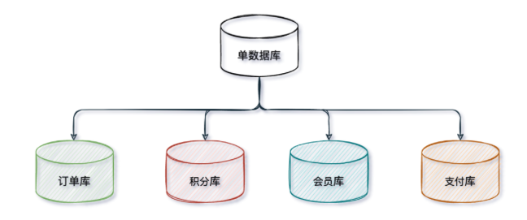
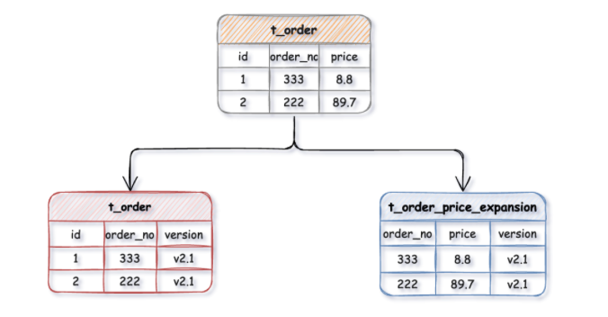
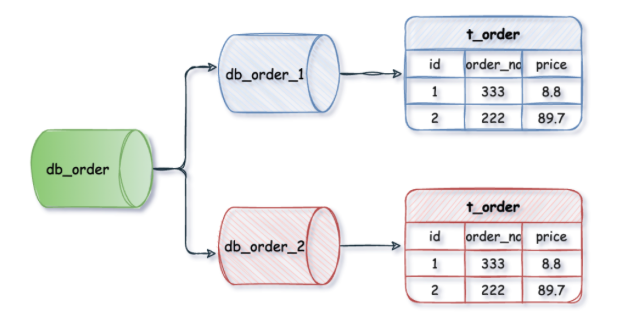
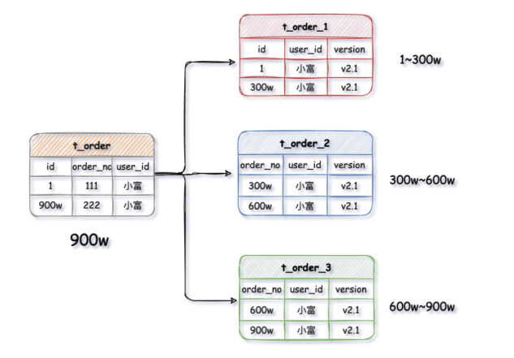
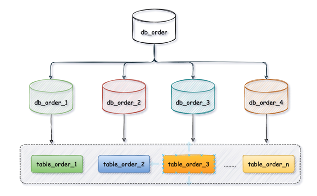

[返回主页](../../Guideline.md)

>单表行数超500万行或者单表容量超过2GB，推荐分库分表。
>
>(阿里开发手册)

*如果预计三年后的数据量根本达不到这个级别，请不要在创建表时就分库分表。*

### 1. 背景

##### 分库分表要解决的是现存海量数据访问的性能瓶颈，对持续激增的数据量所做出的架构预见性。

&nbsp;

### 2. 拆分策略(垂直拆分)

- 2-1) 垂直分库
  垂直分库一般来说按照业务和功能的维度进行拆分，将不同业务数据分别放到不同的数据库中，核心理念是专库专用。
  垂直分库很大程度上取决于业务的划分。
  
    瓶颈: 垂直分库把一个库的压力分摊到多个库，提升了一些数据库性能，但并没有解决由于单表数据量过大导致的性能问题。

- 2-2) 垂直分表
    简单来说就是大表拆小表。

&nbsp;

### 3. 拆分策略(水平拆分)

- 3-1) 水平分库
  
  水平分库是把同一个表按一定规则拆分到不同的数据库中，每个库可以位于不同的服务器上，以此实现水平扩展，是一种常见的提升数据库性能的方式。
  *(eg: db_order_1、db_order_2两个数据库内有完全相同的t_order表，我们在访问某一笔订单时可以通过对订单的订单编号取模的方式 订单编号 mod 2 （数据库实例数） ，指定该订单应该在哪个数据库中操作。)*

- 3-2) 水平分表
  
  水平分表是在同一个数据库内，把一张大数据量的表按一定规则，切分成多个结构完全相同表，而每个表只存原表的一部分数据。
  *(eg: 一张t_order订单表有900万数据，经过水平拆分出来三个表，t_order_1、t_order_2、t_order_3，每张表存有数据300万)*

- 3-3) 水平分库分表

&nbsp;

### 4. 库表访问的路由算法

#####常见的算法有取模算法 、范围限定算法、范围+取模算法 、预定义算法。
