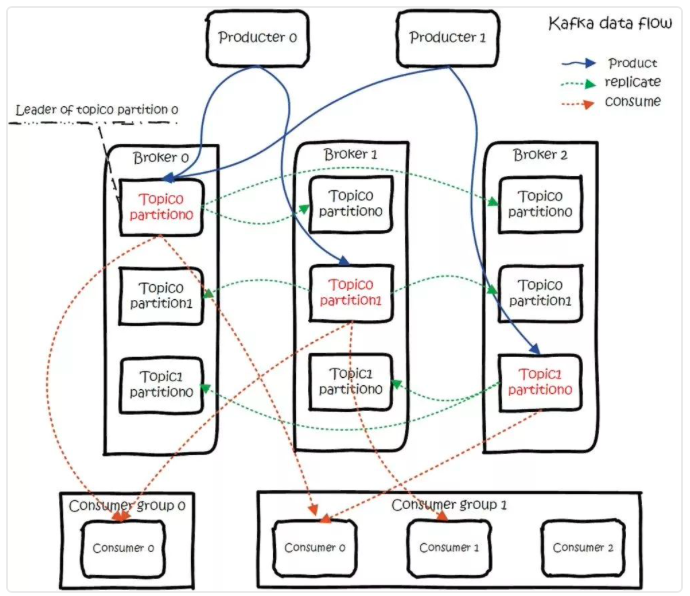
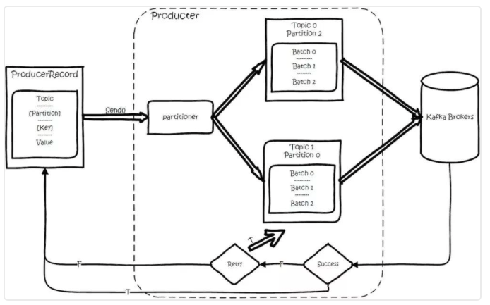

[Back](../../README.md)

### Kafka interview key points

<hr>

### 1. 定义
>Apache Kafka是一个分布式消息队列。具有高性能、持久化、多副本备份、横向扩展能力。生产者往队列里写消息，消费者从队列里取消息进行业务逻辑。一般在架构设计中起到解耦、削峰、异步处理的作用。

&nbsp;

### 2. 核心概念


- Topic

Kafka对外使用topic的概念，生产者往topic里写消息，消费者从读消息。为了做到水平扩展，一个topic实际是由多个partition组成的，遇到瓶颈时，可以通过增加partition的数量来进行横向扩容。单个parition内是保证消息有序。

每新写一条消息，kafka就是在对应的文件append写，所以性能非常高。

总体数据流:



##### 图例讲解:
图中有两个topic，topic 0有两个partition，topic 1有一个partition，三副本备份。可以看到consumer gourp 1中的consumer 2没有分到partition处理，这是有可能出现的。

关于broker、topics、partitions的一些元信息用ZooKeeper来存，监控和路由啥的也都会用到zk。

<hr>

- Producer(生产者)

##### 数据流图



创建一条记录，记录中一个要指定对应的topic和value，key和partition可选。先序列化，然后按照topic和partition，放进对应的发送队列中。kafka produce都是批量请求，会积攒一批，然后一起发送，不是调send()就进行立刻进行网络发包。
如果partition没填，那么情况会是这样的：

1、key有填
按照key进行哈希，相同key去一个partition。（如果扩展了partition的数量那么就不能保证了）
2、key没填
round-robin来选partition，这些要发往同一个partition的请求按照配置，攒一波，然后由一个单独的线程一次性发过去。

<hr>

- partition

当存在多副本的情况下，会尽量把多个副本，分配到不同的broker上。kafka会为partition选出一个leader，之后所有该partition的请求，实际操作的都是leader，然后再同步到其他的follower。当一个broker歇菜后，所有leader在该broker上的partition都会重新选举，选出一个leader。（这里不像分布式文件存储系统那样会自动进行复制保持副本数）

partition的分配

1、将所有Broker（假设共n个Broker）和待分配的Partition排序
2、将第i个Partition分配到第（i mod n）个Broker上 （这个就是leader）
3、将第i个Partition的第j个Replica分配到第（(i + j) mode n）个Broker上

<hr>

- leader容灾

controller会在Zookeeper的/brokers/ids节点上注册Watch，一旦有broker宕机，它就能知道。当broker宕机后，controller就会给受到影响的partition选出新leader。controller从zk的/brokers/topics/[topic]/partitions/[partition]/state中，读取对应partition的ISR（in-sync replica已同步的副本）列表，选一个出来做leader。
选出leader后，更新zk，然后发送LeaderAndISRRequest给受影响的broker，让它们改变知道这事。为什么这里不是使用zk通知，而是直接给broker发送rpc请求，我的理解可能是这样做zk有性能问题吧。

如果ISR列表是空，那么会根据配置，随便选一个replica做leader，或者干脆这个partition就是歇菜。如果ISR列表的有机器，但是也歇菜了，那么还可以等ISR的机器活过来。

<hr>

- 多副本同步

生产者生产消息的时候，通过request.required.acks参数来设置数据的可靠性。
| acks | what happen |
| ---- | ---- |
| 0 | which means that the producer never waits for an acknowledgement from thebroker-发过去就完事了，不关心broker是否处理成功，可能丢数据。|
| 1 | which means that the producer gets an acknowledgement after the leader replica has received the data.当写Leader成功后就返回，其他的replica都是通过fetcher去同步的,所以kafka是异步写，主备切换可能丢数据。|
| -1 | which means that the producer gets an acknowledgement after all in-sync replicas have received the data.要等到isr里所有机器同步成功，才能返回成功，延时取決于最慢的机器。强一致，不会丢数据。|

<hr>

- 消费者

订阅topic是以一个消费组来订阅的，一个消费组里面可以有多个消费者。同一个消费组中的两个消费者，不会同时消费一个partition。换句话来说，就是一个partition，只能被消费组里的一个消费者消费，但是可以同时被多个消费组消费。因此，如果消费组内的消费者如果比partition多的话，那么就会有个别消费者一直空闲。
订阅topic时，可以用正则表达式，如果有新topic匹配上，那能自动订阅上。

<hr>

- offset的保存

在kafka0.10版前，后一个消费组消费partition，需要保存offset记录消费到哪，以前保存在zk中，由于zk的写性能不好，以前的解决方法都是consumer每隔一分钟上报一次。这里zk的性能严重影响了消费的速度，而且很容易出现重复消费。

在kafka0.10版本后，kafka把这个offset的保存，从zk总剥离，保存在一个名叫__consumeroffsets topic的topic中。写进消息的key由groupid、topic、partition组成，value是偏移量offset。topic配置的清理策略是compact。总是保留最新的key，其余删掉。一般情况下，每个key的offset都是缓存在内存中，查询的时候不用遍历partition，如果没有缓存，第一次就会遍历partition建立缓存，然后查询返回。

确定consumer group位移信息写入__consumers_offsets的哪个partition，具体计算公式：
```java
__consumers_offsets partition =
          Math.abs(groupId.hashCode() % groupMetadataTopicPartitionCount)   
//groupMetadataTopicPartitionCount由offsets.topic.num.partitions指定，默认是50个分区。
```
