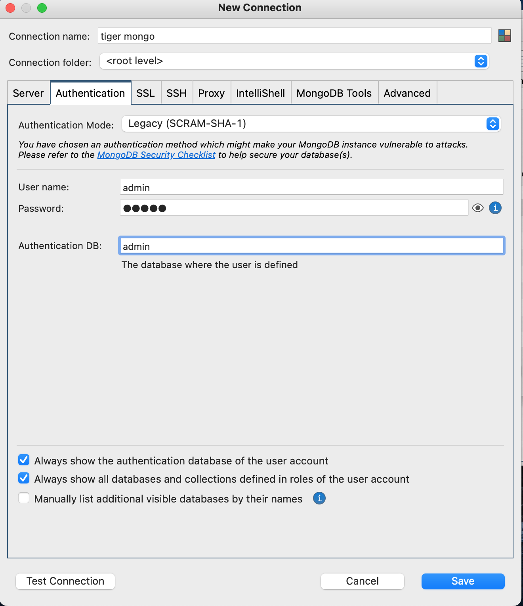

####1. 解压安装包
```
cd /install_pkg/

tar -zxvf mongodb-linux-x86_64-rhel70-4.4.4.tgz
mv mongodb-linux-x86_64-rhel70-4.4.4 /soft/mongodb
```

&nbsp;

####2. 全局配置
```
vi /etc/profile

# mongodb
export MONGO_HOME=/soft/mongodb
export PATH=${MONGO_HOME}/bin:$PATH

source /etc/profile

```

&nbsp;

####3. 创建数据和日志目录
```
cd /soft/mongodb
mkdir logs data

```

&nbsp;

####4. 创建conf配置文件
```
cd /soft/mongodb/bin
vi mongodb.conf

#########################
# mongodb 配置文件
#########################

# 端口
port=27017 

# 默认是127.0.0.1
bind_ip=0.0.0.0 

# 数据库存放
dbpath=/soft/mongodb/data

# 日志文件 
logpath=/soft/mongodb/logs/mongodb.log

# 设置后台运行
fork=true

# 开启认证
#auth=true
```

&nbsp;


####5. 配置防火墙放行端口

```
# 放行 27017 端口号 使用默认的
firewall-cmd --zone=public --add-port=27017/tcp --permanent

# 查看放行端口号
firewall-cmd --list-ports

# 重启防火墙
firewall-cmd --reload 
```

&nbsp;

####6. 启动mongodb
```
# 启动
mongod --config mongodb.conf

# 检查
ps aux|grep mongo
```

&nbsp;

####7. 本机连接测试
```
# 连接客户端 
mongo

# 插入数据 
db.pigs.insert({'a':'b'})

# 查询数据(ps: pigs 这个是自己定义的)
db.pigs.find()

# 退出客户端
exit
```

&nbsp;

####8. 配置安全账户
```
mongo
use admin

db.createUser(
	{user: "admin",
	 pwd: "admin",
	 roles: [{role:"root",db:"admin"}]
	}
)

# bin下新增配置文件mongod.cfg

# store data
storage:
	dbPath: /soft/mongodb/data
	journal:
		enabled: true

# log data
systemLog:
	destination: file
	logAppend: true
	path: /soft/mongodb/logs/mongod.log

# network interfaces
net:
	port: 27017
	bindIp: 0.0.0.0

security:
	authorization: enabled
	
```

&nbsp;


####9. 用新的配置文件重启mongodb & 关机
```
# 启动
mongod --fork --config $MONGO_HOME/bin/mongod.cfg

# 关机
mongo
use admin
db.shutdownServer();
```

####9. 远程工具连接(studio 3t)



