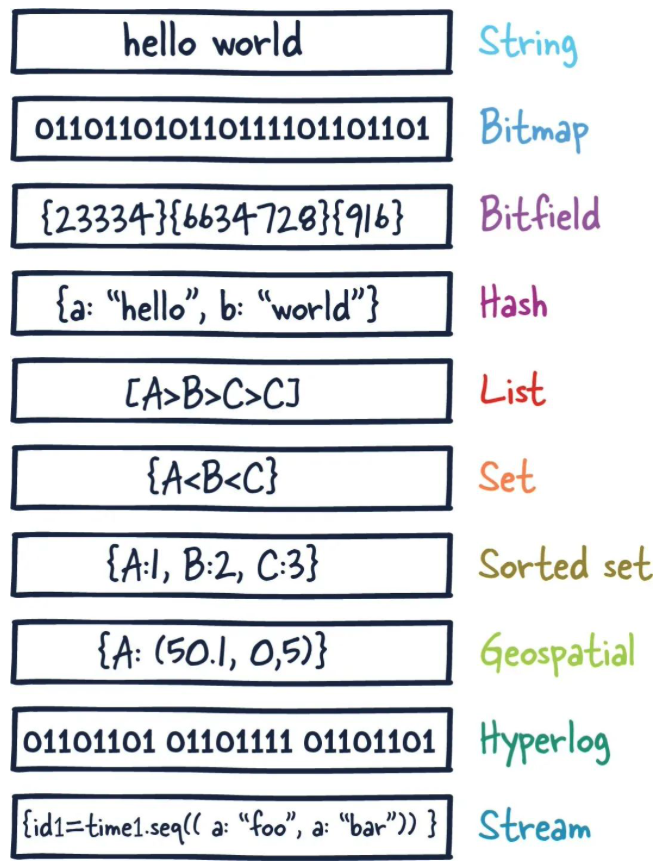
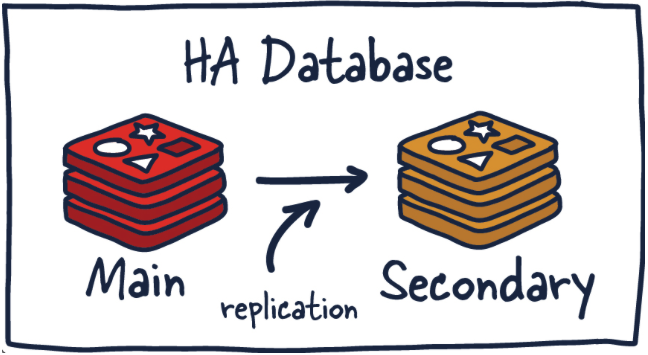

[Back](README.md)

### Introduce Redis

### 1. 什么是 Redis

- 定义
    >Redis（Remote Dictionary Service）是一个开源的键值对数据库服务器。
    Redis 更准确的描述是一个数据结构服务器。Redis 的这种特殊性质让它在开发人员中很受欢迎。

Redis不是通过迭代或者排序方式处理数据，而是一开始就按照数据结构方式组织。早期，它的使用很像 Memcached，但随着 Redis 的改进，它在许多其他用例中变得可行，包括发布-订阅机制、流（streaming）和队列。

- 用途
    >主要来说，Redis 是一个内存数据库，用作另一个“真实”数据库（如 MySQL 或 PostgreSQL）前面的缓存，以帮助提高应用程序性能。它通过利用内存的高速访问速度，从而减轻核心应用程序数据库的负载。

&nbsp;

### 2. Redis部署方式介绍

- 单实例部署
    单个 Redis 实例是最直接的 Redis 部署方式，常用于开发模式。

- 高可用部署(HA)
    >Redis高可用部署(HA)即主从部署方式，从部署保持与主部署之间数据同步。

##### 原理:
当数据写入主实例时，它会将这些命令的副本发送到从部署客户端输出缓冲区，从而达到数据同步的效果。从部署可以有一个或多个实例。这些实例可以帮助扩展 Redis 的读取操作或提供故障转移，以防 main 丢失。
