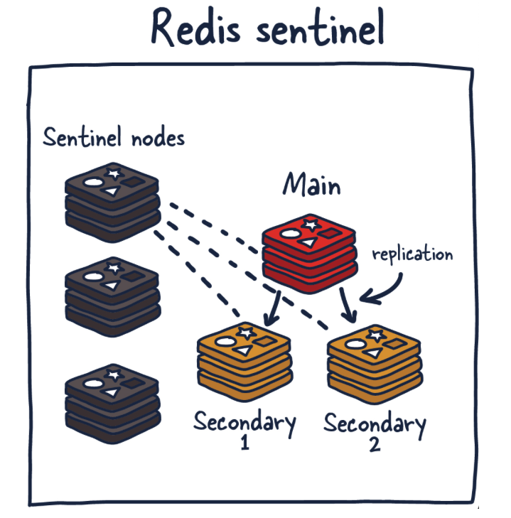

[Back](README.md)

### Introduce Redis

### 1. 什么是 Redis

- 定义
    >Redis（Remote Dictionary Service）是一个开源的键值对数据库服务器。
    Redis 更准确的描述是一个数据结构服务器。Redis 的这种特殊性质让它在开发人员中很受欢迎。

Redis不是通过迭代或者排序方式处理数据，而是一开始就按照数据结构方式组织。早期，它的使用很像 Memcached，但随着 Redis 的改进，它在许多其他用例中变得可行，包括发布-订阅机制、流（streaming）和队列。

- 用途
    >主要来说，Redis 是一个内存数据库，用作另一个“真实”数据库（如 MySQL 或 PostgreSQL）前面的缓存，以帮助提高应用程序性能。它通过利用内存的高速访问速度，从而减轻核心应用程序数据库的负载。

&nbsp;

### 2. Redis部署方式介绍

- 单实例部署
    单个 Redis 实例是最直接的 Redis 部署方式，常用于开发模式。

- 高可用部署(HA)
    >Redis高可用部署(HA)即主从部署方式，从部署保持与主部署之间数据同步。

##### 原理:
当数据写入主实例时，它会将这些命令的副本发送到从部署客户端输出缓冲区，从而达到数据同步的效果。从部署可以有一个或多个实例。这些实例可以帮助扩展 Redis 的读取操作或提供故障转移，以防 main 丢失。

- Redis 复制

##### 原理:

Redis 的每个主实例都有一个复制 ID 和一个偏移量。这两条数据对于确定副本可以继续其复制过程的时间点或确定它是否需要进行完整同步至关重要。对于主 Redis 部署上发生的每个操作，此偏移量都会增加。

当 Redis 副本实例仅落后于主实例几个偏移量时，它会从主实例接收剩余的命令，然后在其数据集上重放，直到同步完成。
如果两个实例无法就复制 ID 达成一致，或者主实例不知道偏移量，则副本将请求全量同步。这时主实例会创建一个新的 RDB 快照并将其发送到副本。
在此传输之间，主实例会缓冲快照截止和当前偏移之间的所有中间更新指令，这样在快照同步完后，再将这些指令发送到副本实例。这样完成后，复制就可以正常继续。
如果一个实例具有相同的复制 ID 和偏移量，则它们具有完全相同的数据。

eg:
两个实例（主实例和从实例）具有相同的复制 ID，但偏移量相差几百个命令，这意味着如果在实例上重放这些偏移量后面的命令，它们将具有相同的数据集。现在，如果复制 ID 完全不同，并且我们不知道新降级（或重新加入）从节点的先前复制 ID（没有共同祖先）。我们将需要执行昂贵的全量同步。

- Redis 哨兵（Sentinel）

Sentinel 是一个分布式系统。
Sentinel 的设计方式是，一组哨兵进程协同工作以协调状态，从而为 Redis 提供高可用性。
Sentinel 负责一些事情。首先，它确保当前的主实例和从实例正常运行并做出响应。这是必要的，因为哨兵（与其他哨兵进程）可以在主节点和/或从节点丢失的情况下发出警报并采取行动。其次，它在服务发现中发挥作用，就像其他系统中的 Zookeeper 和 Consul 一样。所以当一个新的客户端尝试向 Redis 写东西时，Sentinel 会告诉客户端当前的主实例是什么。

因此，哨兵不断监控可用性并将该信息发送给客户端，以便他们能够在他们确实进行故障转移时对其做出反应。

哨兵（Sentinel）的职责：

监控——确保主从实例按预期工作。

通知——通知系统管理员 Redis 实例中的事件。

故障转移管理——如果主实例不可用并且足够多的（法定数量）节点同意这是真的，Sentinel 节点可以启动故障转移。

配置管理——Sentinel 节点还充当当前主 Redis 实例的发现服务。