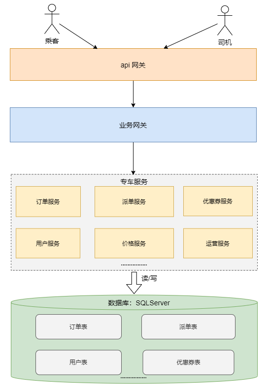
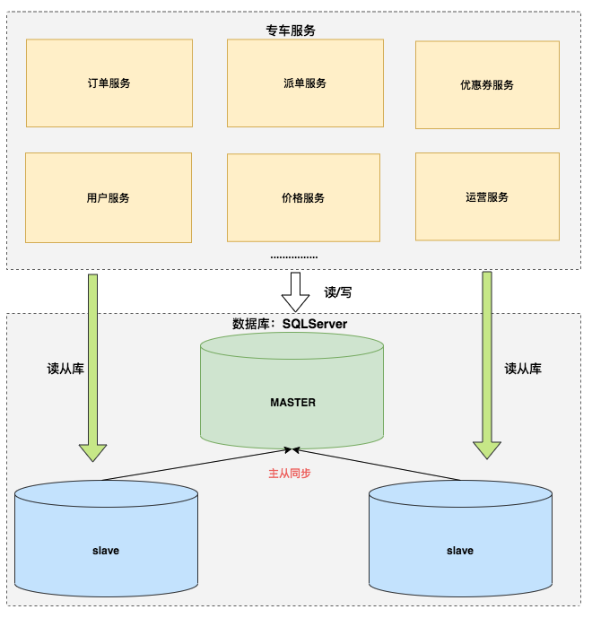
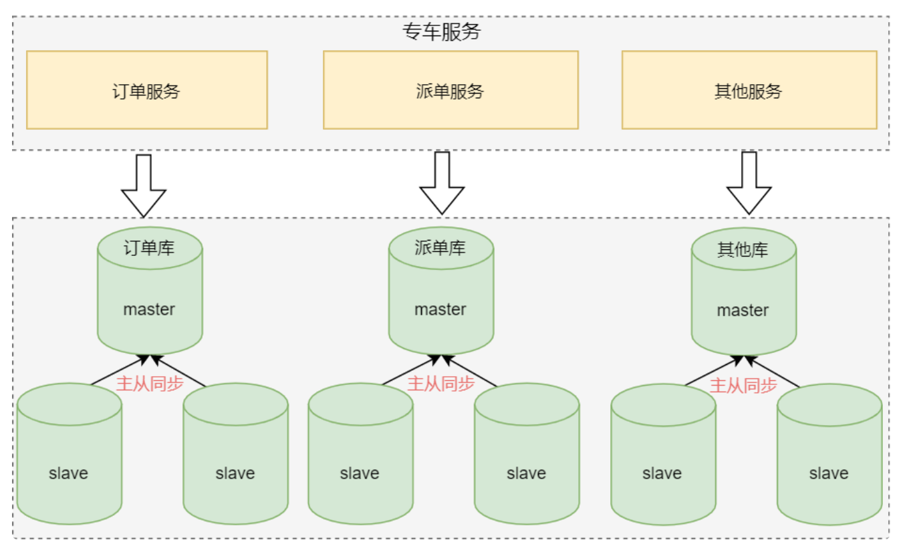
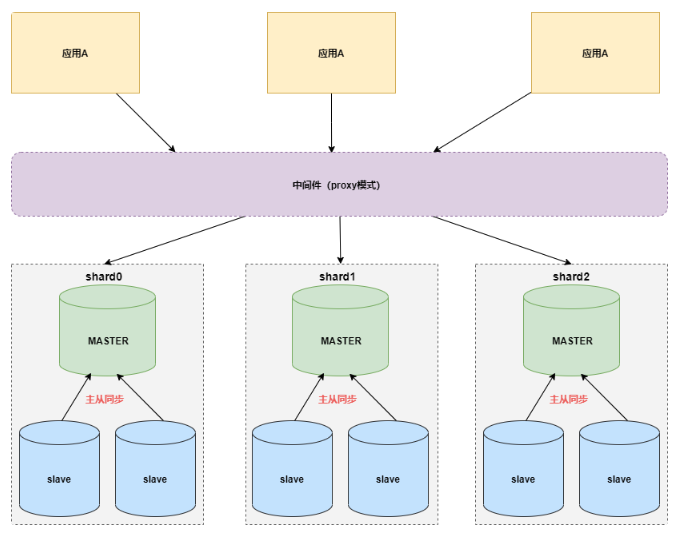
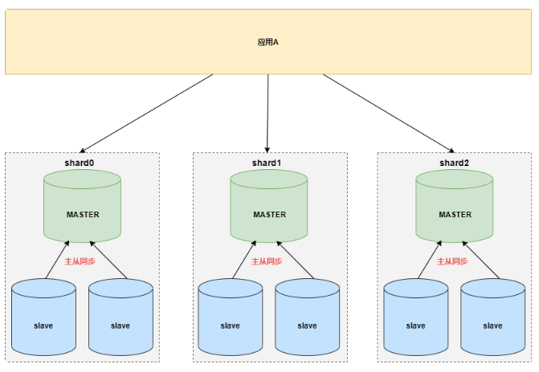
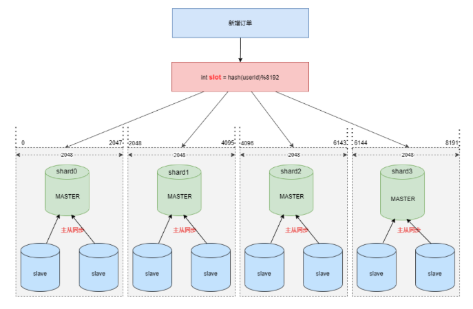
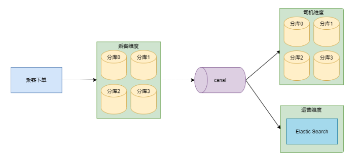
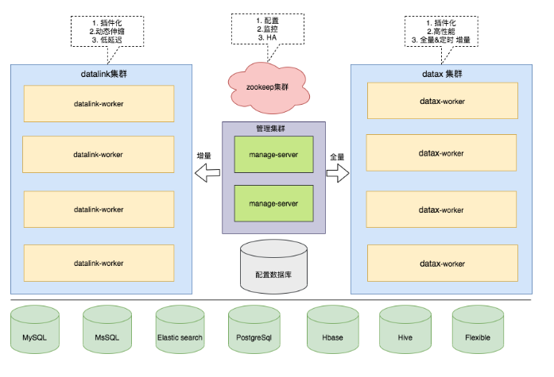

[返回主页](../../Guideline.md)

>”好的架构是进化来的，不是设计来的“
>
>(Good architecture is made by evolution not design)

## 例子场景: 专车服务

### 1. 单数据库架构

产品初期，技术团队的核心目标是：“快速实现产品需求，尽早对外提供服务”。

- 产生的问题
   1) 数据库瓶颈: 频繁的磁盘操作导致数据库服务器 IO 消耗增加，同时多表关联，排序，分组，非索引字段条件查询也会让 cpu 飙升，最终都会导致数据库连接数激增；

    

    2) 高并发场景下资源不够导致请求阻塞: 大量请求直接操作数据库，数据库连接资源不够用，大量请求处于阻塞状态。 

&nbsp;

### 2. SQL优化和读写分离

通过SQL优化来缓解主数据库的压力。

- 解决措施一(SQL优化)

1) 性能监控平台分析慢SQL。
2) 合理添加索引。
3) 减少多表 JOIN 关联，通过程序组装。
4) 减少大事务，尽快释放数据库连接。

- 解决措施二(读写分离)
读写分离的基本原理是让主数据库处理事务性增、改、删操作（ INSERT、UPDATE、DELETE），而从数据库处理 SELECT 查询操作。
*读写分离架构图如下:*

- 产生的问题

1) 主从延迟的问题，订单服务载客流程中对实时性要求较高，因为担心延迟问题，大量操作依然使用主库查询
2) 读写分离可以缓解读压力，但是写操作的压力随着业务爆发式的增长并没有很有效的缓解。

&nbsp;

### 3. 业务领域分库

虽然应用层面做了优化，数据层也做了读写分离，但主库的压力依然很大。

解决方案:
- 业务领域分库
>将数据库按业务领域拆分成不同的业务数据库，每个系统仅访问对应业务的数据库。
*业务领域分库架构图如下:*

- 优点:
  业务领域分库可以缓解核心数据库的性能压力，同时也减少系统间的相互影响，提升了系统整体稳定性。

- 重构重点包含两个部分：
    1) 原来需要 JOIN 关联的查询修改成 RPC 调用，程序中组装数据 ；
    2) 业务表适当冗余字段，通过消息队列或者异构工具同步。

&nbsp;

### 4. 缓存和MQ

引入缓存和MQ可以更好地缓解核心业务数据库的读写压力。

- 缓存场景1(立即叫车)
    a. 订单服务创建订单，首先保存到数据库后
    b. 然后将订单信息同步保存到缓存中

- 缓存场景2(订单载客)
    a. 订单的修改操作先修改缓存
    b. 然后发送消息到MQ 
    c. 订单落盘服务消费消息，并判断订单信息是否正常（比如有无乱序)，若订单数据无误，则存储到数据库中

- 核心逻辑有两点：
    1. 缓存集群中存储最近七天订单详情信息，大量订单读请求直接从缓存获取；
    2. 在订单的载客生命周期里，写操作先修改缓存，通过消息队列异步落盘，这样消息队列可以起到消峰的作用，同样可以降低数据库的压力。

&nbsp;

### 5. 自研分库分表组件

业界分库分表一般有 proxy 和 client 两种流派。

- proxy模式

代理层分片业界产品: Mycat ，cobar 等。
优点：应用零改动，和语言无关，可以通过连接共享减少连接数消耗。
缺点：因为是代理层，存在额外的时延。

- client模式

应用层分片业界产品: sharding-jdbc ，TDDL 等。
优点：直连数据库，额外开销小，实现简单，轻量级中间件。
缺点：无法减少连接数消耗，有一定的侵入性，多数只支持Java语言。

&nbsp;

### 6. 分库分表策略

cobar 支持最大分片数是1024, 而 SDDL 最大支持分库数1024*8=8192。

&nbsp;

### 7. 数据同步

订单数据落盘在乘客维度的订单分库之后，通过 canal 把数据同步到Elastic Search。

&nbsp;

### 8. 小表广播

- 场景
业务中有一些配置表，存储重要的配置，读多写少。在实际业务查询中，很多业务表会和配置表进行联合数据查询。但在数据库水平拆分后，配置表是无法拆分的。

- 解决方案
小表广播
小表广播的原理是：将小表的所有数据（包括增量更新）自动广播（即复制）到大表的机器上。这样，原来的分布式 JOIN 查询就变成单机本地查询，从而大大提高了效率。
*eg: 专车场景下，城市表是非常重要的配置表，数据量非常小，但订单服务，派单服务，用户服务都依赖这张表。
通过 canal 将基础配置数据库城市表同步到订单数据库，派单数据库，用户数据库。*

&nbsp;

### 9. 数据交换平台

- 场景
增量数据迁移通过 canal 来实现。随着专车业务的爆发增长，数据库镜像，实时索引构建，分库异构等需求越来越多，虽然canal 非常优秀，但它还是有瑕疵，比如缺失任务控制台，数据源管理能力，任务级别的监控和报警，操作审计等功能。

- 解决方案
面对这些问题，架构团队的目标是打造一个平台，满足各种异构数据源之间的实时增量同步和离线全量同步，支撑公司业务的快速发展。

基于这个目标，架构团队自研了 data-link-platform 用于增量数据同步，深度定制了阿里开源的 dataX 用于全量数据同步。

