### 1. Design & Publish API

- Create Your API Specification in Design Center

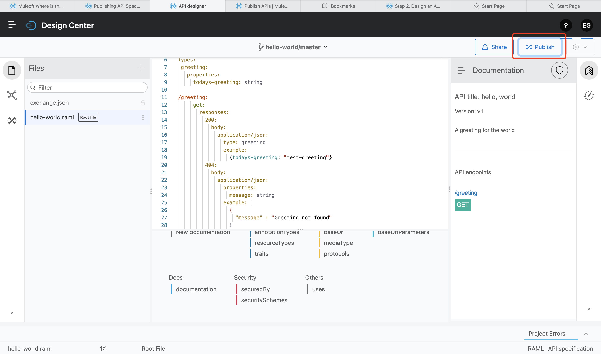

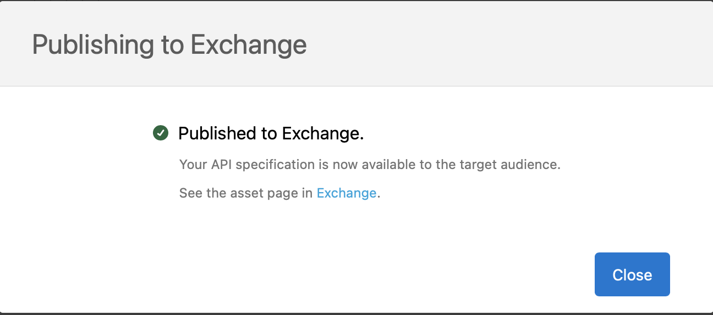

You can publish assets to the public Exchange, your internal Exchange, or your public developer portal.

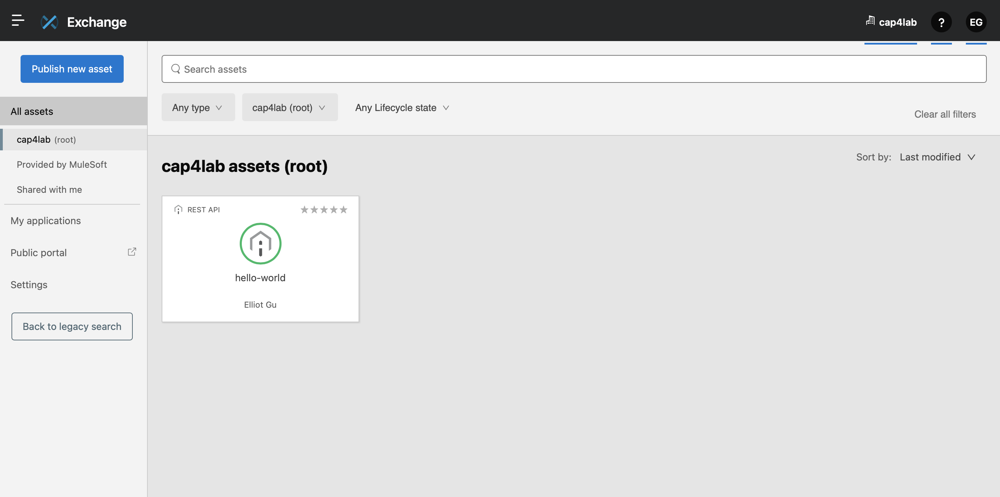

### 2. Develop the API

##### 2-1) Add Your Anypoint Platform Credentials to Studio

1. Open Studio, and then click Anypoint Studio > Preferences(Settings).

2. Select Anypoint Studio > Authentication.

3. Click Add and enter your Anypoint Platform username and password.

4. Optionally, enter a duration in days for how long this authentication is valid.

5. Click Sign in.

6. Click Apply and Close.

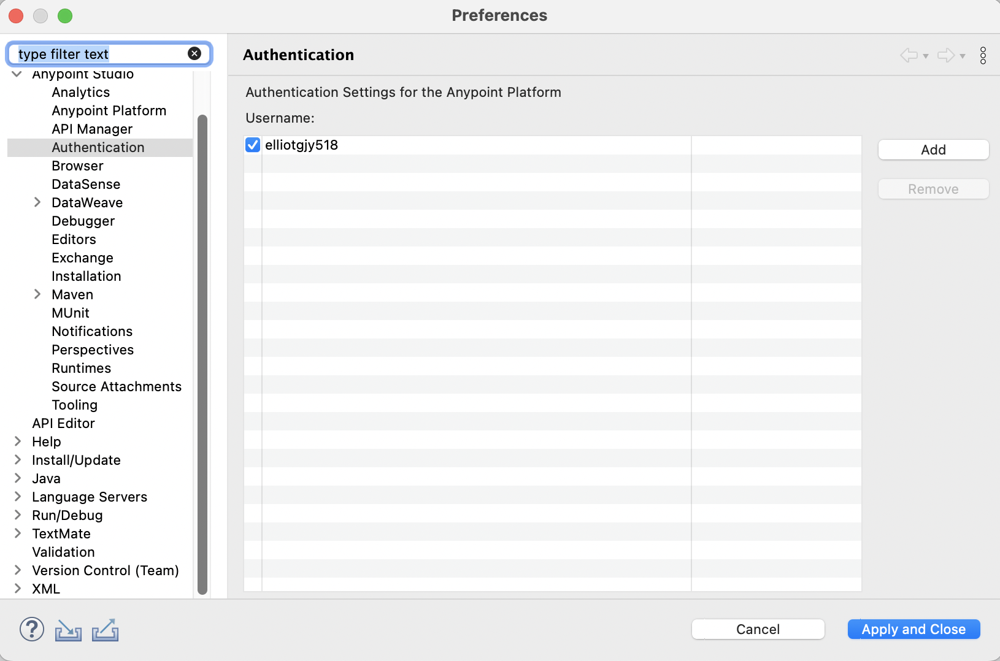

##### 2-2) Create a New Studio Project with an Imported API Specification

1. In Studio, select File > New > Mule Project

2. Select the Import a published API tab

    2-1) Click the green plus sign, and then select From Exchange.

    2-2) Log in to your organization if needed.

    2-3) Type hello-world in the search box.

    2-4) Click hello-world to select it.

    2-5) Click Add to move it to the Selected modules list.

    2-6) Click Finish.

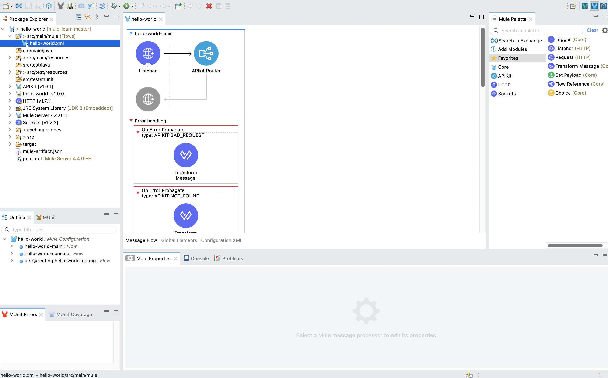

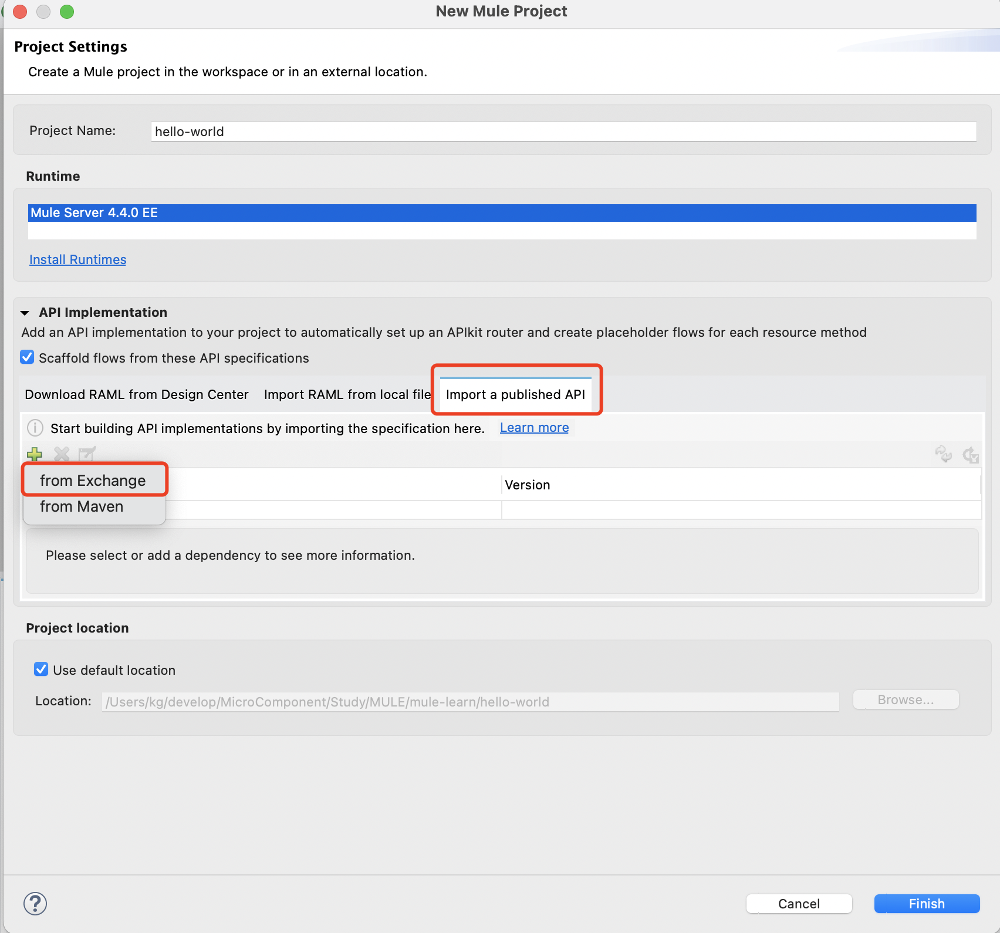

##### All the scaffolding added to your API:

- HTTP Listener is ready to receive requests

- APIkit Router routes messages

- Error handlers for different error conditions

- A console, eg: hello-world-console

- The GET request to endpoint /greeting, where we will do the bulk of our configuration.

##### Three different views of the canvas:

- Message Flow view
    Makes it easy to drag and drop modules, connectors, and other assets and create the relationships between them.

- Global Elements view
    Makes it easy to specify global elements used in multiple projects.

- Configuration XML view
    Makes it easy to edit the XML of a project directly.

##### 2-3) Configure the API

1. In Message Flow tab of the canvas, scroll down until you see the /greeting endpoint module.

2. Right-click the Transform Message and delete it.

3. In Mule Palette, select Favorites to display a list of core connectors.

4. Click Set Payload to select it, and then drag it into the space where you deleted Transform Message, to the right of the area labeled Source.

5. Specify the logic that displays the data sent in a response from hello-world API:

    a. Click the Set Payload transformer you just added to the flow.
    b. Below the canvas, in the General tab, click the fx (function) button to deselect it. For this tutorial, we are hard-coding the value.
    c. Set Value under Settings to Today the greeting is Hello.

You have created a project that contains a simple Mule app which you can deploy to expose your API.

##### 2-4) Test the API

1. Right-click anywhere on the canvas and select Run project hello-world.

2. To test the app, open a REST client (Advanced Rest Client) and issue a GET request:
    http://localhost:8081/api/greeting

    Your REST client should return a 200 OK with the message: Today the greeting is Hello

3. Right-click in the canvas and select Stop project hello-word.

##### 2-5) Create a Business Group in Your Organization

Before you can publish your API to Exchange to share it with others, you must create a Business Group in your trial organization. Assets in Exchange must belong to a Business Group that is not the root Business Group.

1. Anypoint Platform:
Management Center > Access Management

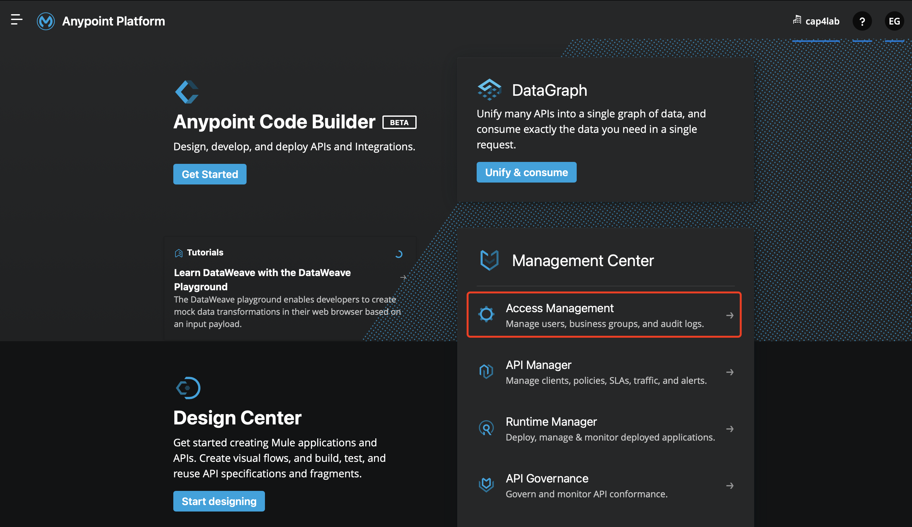

2. Click Add Business Group and enter these values:

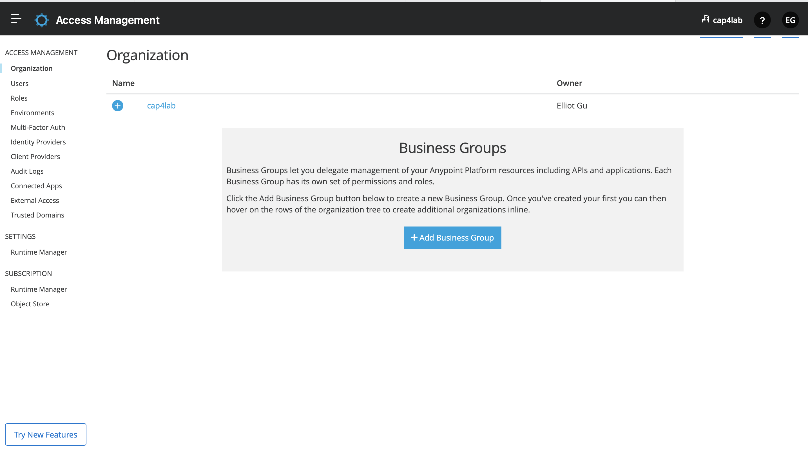

- Business Group name: My Top Business Group

- Owner: Search for your name and select it.

- Select Owner can create environment.

- Leave the default for all other values.

##### 2-6) Publish the API to Exchange

1. From the Package Explorer in Studio, right-click the hello-world project.

2. Select Anypoint Platform > Publish to Exchange.

After the project is uploaded to Exchange, you are provided with a direct link to the project:
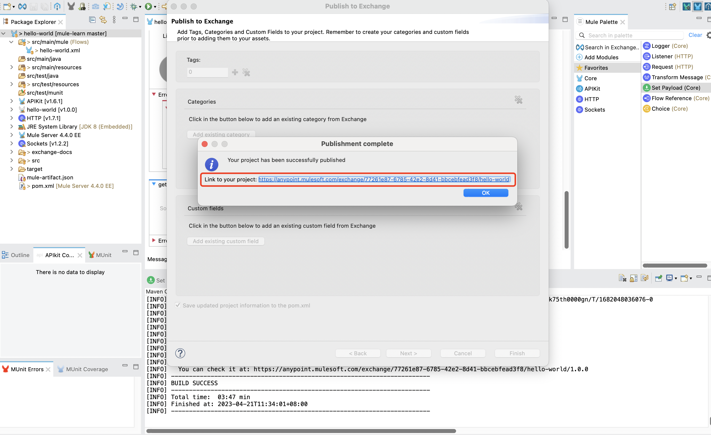

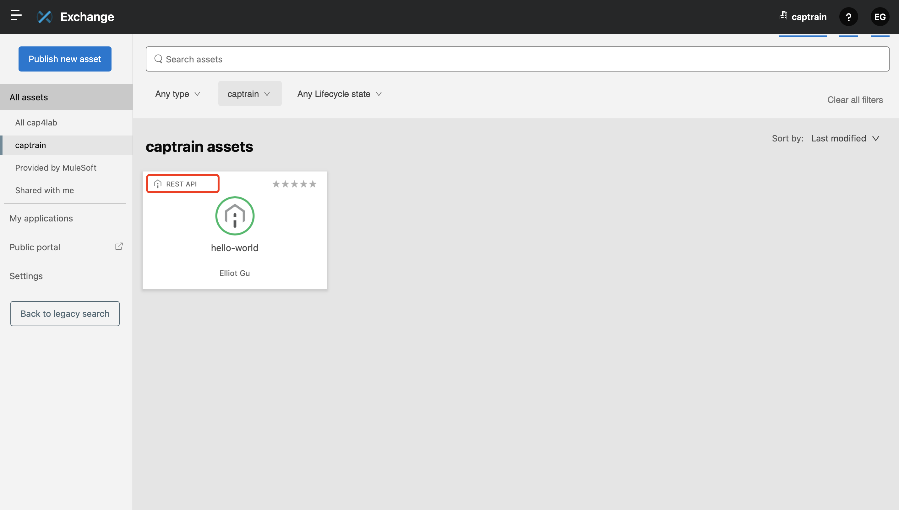

https://anypoint.mulesoft.com/exchange/83af8d60-b8d4-41f2-898b-6304972d7370/hello-world/minor/1.0/pages/home/

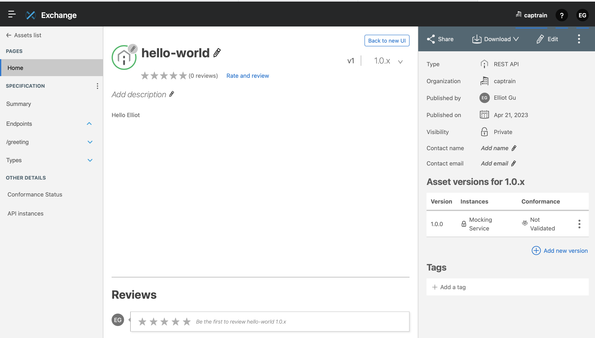

