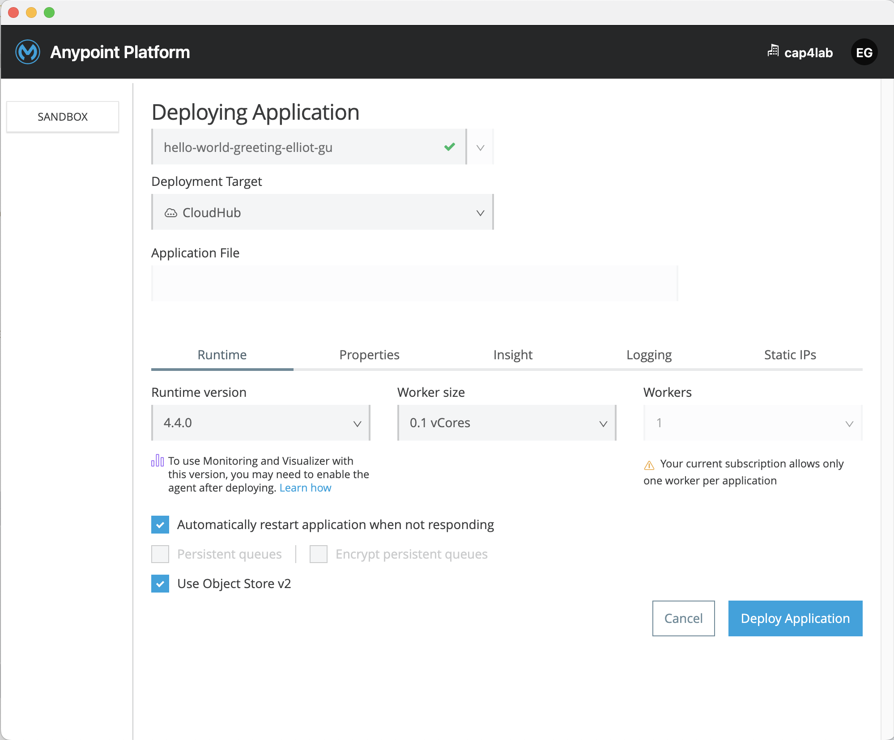

[Back](README.md)

## Deploy the API to CloudHub

<hr>

### 1. Deploy API to CloudHub

1. From Studio, right-click the project, select [Anypoint Platform > Deploy to CloudHub]

2. Sign in and choose SANDBOX

3. Enter hello-world-greeting-firstname-lastname(eg: hello-world-greeting-elliot-gu)

    

4. Click "Open in Browser" to see the status displayed in Runtime Manager

    

5. To test the API deployment, send a request from Advanced Rest Client(Postman):

    a. Click Started to display the App url.

    b. Copy the value: hello-world-greeting-elliot-gu.us-e2.cloudhub.io for this example.

    c. In Advanced Rest Client, send a request to the base URI that you just copied. Be sure to add the API endpoint /greeting:
    ```
    GET http://hello-world-greeting-elliot-gu.us-e2.cloudhub.io/api/greeting
    ```

    d. If you see 200 OK and the greeting you specified, The specified message is either too long or too short, then you have successfully deployed the API you created.

&nbsp;

### 2. Create an API Proxy Application

In order to add a rate limit policy to our deployed API, we must first add our API to API Manager, and create an API proxy.

1. Log in to Anypoint Platform

2. Click API Manager

3. Switch to the sandbox environment

4. Click Manage API > Manage API from Exchange


