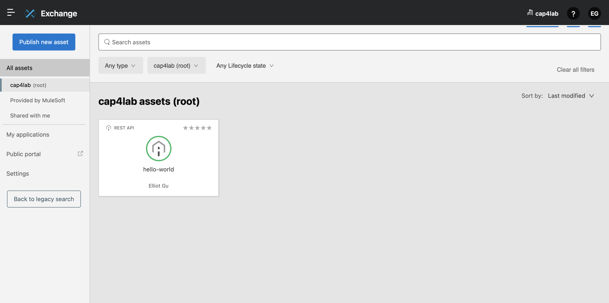
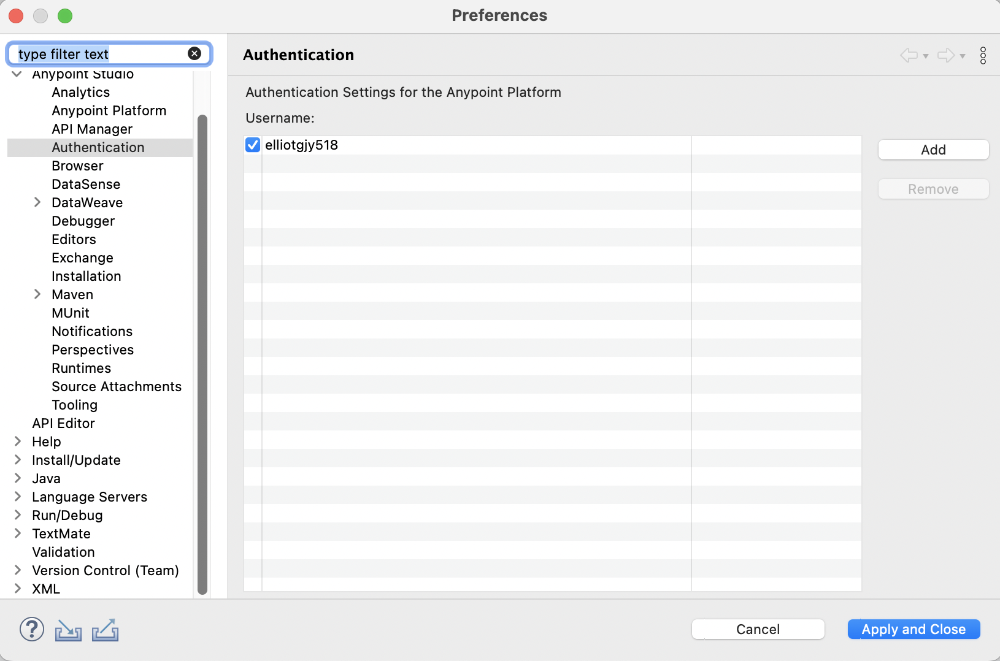

### 1. Design & Publish API

- Create Your API Specification in Design Center

You can publish assets to the public Exchange, your internal Exchange, or your public developer portal.

### 2. Develop the API

##### 2-1) Add Your Anypoint Platform Credentials to Studio

1. Open Studio, and then click Anypoint Studio > Preferences(Settings).

2. Select Anypoint Studio > Authentication.

3. Click Add and enter your Anypoint Platform username and password.

4. Optionally, enter a duration in days for how long this authentication is valid.

5. Click Sign in.

6. Click Apply and Close.

##### 2-2) Create a New Studio Project with an Imported API Specification

1. In Studio, select File > New > Mule Project

2. Select the Import a published API tab

    2-1) Click the green plus sign, and then select From Exchange.

    2-2) Log in to your organization if needed.

    2-3) Type hello-world in the search box.

    2-4) Click hello-world to select it.

    2-5) Click Add to move it to the Selected modules list.

    2-6) Click Finish.

##### All the scaffolding added to your API:

- HTTP Listener is ready to receive requests

- APIkit Router routes messages

- Error handlers for different error conditions

- A console, eg: hello-world-console

- The GET request to endpoint /greeting, where we will do the bulk of our configuration.

