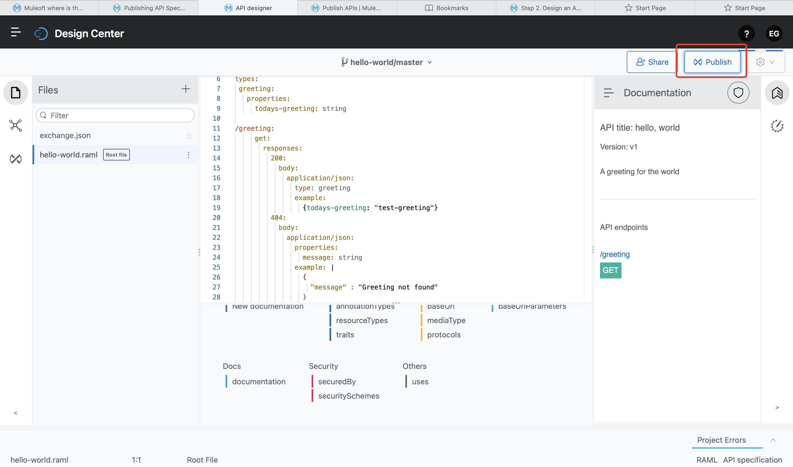

### 1. Design & Publish API

- Create Your API Specification in Design Center

You can publish assets to the public Exchange, your internal Exchange, or your public developer portal.

### 2. Develop the API

##### 2-1) Add Your Anypoint Platform Credentials to Studio

1. Open Studio, and then click Anypoint Studio > Preferences(Settings).

2. Select Anypoint Studio > Authentication.

3. Click Add and enter your Anypoint Platform username and password.

4. Optionally, enter a duration in days for how long this authentication is valid.

5. Click Sign in.

6. Click Apply and Close.

