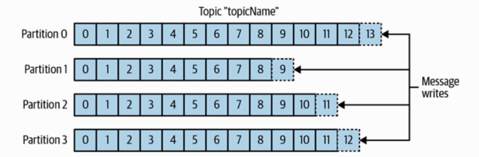
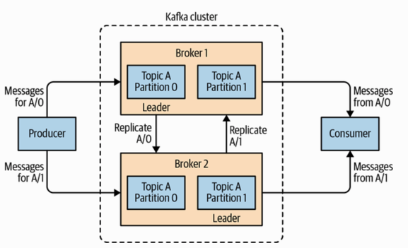
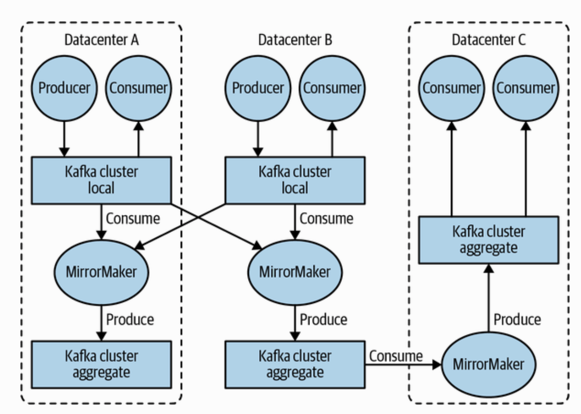

[Back](../README.md)

<hr>

### 1. Topics and Partitions

#### Messages in Kafka are categorized into topics.

>The closest analogies for a topic are a database table or a folder in a filesystem.

####Topics are additionally broken down into a number of partitions. 

#### partition is a single log.

```
a. Messages are written to partitions in an append-only fashion and are read in order 
   from beginning to end.

b. There is no guarantee of message ordering across the entire topic, 
   just within a single partition.

c. Partitions are also the way that Kafka provides redundancy and scalability.

d. Each partition can be hosted on a different server, 
   which means that a single topic can be scaled horizontally across multiple servers 
    to provide performance far beyond the ability of a single server. 
   Additionally, partitions can be replicated, so that different servers will store a copy of 
    the same partition in case one server fails.
```



&nbsp;

### 2. Stream

####A stream is considered to be a single topic of data, regardless of the number of partitions.

&nbsp;

### 3. Producers and Consumers

#### There are two basic types of kafka clients: producers and consumers.

- Producer
```
Producers create new messages. 
In other publish/subscribe systems, these may be called publishers or writers. 
```

- Consumer
```
Consumers read messages. 
In other publish/subscribe systems, these clients may be called subscribers or readers. 
The consumer subscribes to one or more topics and reads the messages in the order in which 
they were produced to each partition.
```

- Offset
```
Each message in a given partition has a unique offset.
By storing the next possible offset for each partition, typically in Kafka itself,
a consumer can stop and restart without losing its place.
```


&nbsp;

### 4. Brokers and Clusters

- Broker
  #### A single Kafka server is called a broker.
  ```
  Producers --send message--> Brokder --respond to--> Consumers
  
  A single broker can easily handle thousands of partitions and 
   millions of messages per second.
  ```

- Cluster of Brokers
```
a. cluster controller
   One broker will also function as the cluster controller.
   (elected automatically from the live members of the cluster)
   The controller is responsible for administrative operations, 
    including assigning partitions to brokers and monitoring for broker failures.


b. Leader of the partition
   A broker in the cluster which ownes a partition is called the leader of the partition.
   
c. Fowllers of the partition
   The additional brokers which replicates the partition is called followers of the partition.
```

#### partition replication


&nbsp;

### 5. Multiple Clusters

- MirrorMaker

```
The Kafka project includes a tool called MirrorMaker, used for replicating data 
to other clusters. 
At its core, MirrorMaker is simply a Kafka consumer and producer, linked together with a queue. 
Messages are consumed from one Kafka cluster and produced to another.
```

- Multiple datacenters architecture



- Multiple Producers

```
Eg: a site that serves content to users via a number of microservices can have a single topic 
for page views that all services can write to using a common format. 
Consumer applications can then receive a single stream of page views for all applications 
on the site without having to coordinate consuming from multiple topics, one for each application.
```

- Multiple Consumers

```
In addition to multiple producers, Kafka is designed for multiple consumers to read 
any single stream of messages without interfering with each other client. 
This is in contrast to many queuing systems where once a message is consumed by one client, 
it is not available to any other. 
```

&nbsp;

### 6. Use Cases

- Activity tracking

```
The original use case for Kafka, as it was designed at LinkedIn, is that of user activity tracking. 
A website’s users interact with frontend applications, which generate messages 
regarding actions the user is taking.

eg:
This can be passive information, such as page views and click tracking, 
or it can be more complex actions, such as information that a user adds to their profile.

The messages are published to one or more topics, which are then consumed 
by applications on the backend.
```

- Messaging

```
Kafka is also used for messaging, where applications need to send notifications (such as emails) to users.
```

- Metrics and logging

```
Kafka is also ideal for collecting application and system metrics and logs.
```

