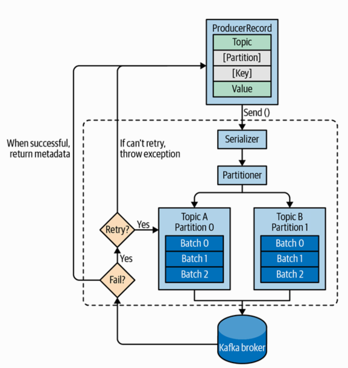

###1. High-level overview of Kafka producer components



###WorkFlow

i. Creating a ProducerRecord
```
ProducerRecord must include the topic we want to send the record to and a value. 
Optionally, we can also specify a key, a partition, a timestamp, and/or a collection of headers.
```

ii. Serialize the key and value
```
Once we send the ProducerRecord, the first thing the producer 
will do is serialize the key and value objects to byte arrays so 
they can be sent over the network.
```

iii. Choose a partition
```
Next, if we didn’t explicitly specify a partition, the data is sent to a partitioner. 
The partitioner will choose a partition for us, usually based on the ProducerRecord key. 
```

iv. Sending batches of records to brokers
```
Once a partition is selected, the producer knows which topic and partition the record will go to. 
It then adds the record to a batch of records that will also be sent to the same topic 
and partition. 
A separate thread is responsible for sending those batches of records to the appropriate 
Kafka brokers.
```

v. Broker confirm
```
When the broker receives the messages, it sends back a response. 
If the messages were successfully written to Kafka, it will return a RecordMetadata 
object with the topic, partition, and the offset of the record within the partition. 
```

vi. Fail retry
```
If the broker failed to write the messages it will return an error. 
When the producer receives an error, it may retry sending the message 
a few more times before giving up and returning an error.
```

&nbsp;

###2. Constructing a Kafka Producer

####A Kafka producer has three mandatory properties:

- bootstrap.servers

####List of host:port pairs of brokers that the producer will use to establish initial connection to the Kafka cluster.

```
This list doesn’t need to include all brokers, since the producer will get more information 
after the initial connection. But it is recommended to include at least two, 
so in case one broker goes down, the producer will still be able to connect to the cluster.
```

<hr>

- key.serializer

####Name of a class that will be used to serialize the keys of the records we will produce to Kafka.

```
key.serializer should be set to a name of a class that implements the 
org.apache.kafka.common.serialization.Serializer interface.

The Kafka client package includes ByteArraySerializer(which doesn’t do much), 
StringSerializer, IntegerSerializer, and much more, 
so if you use common types, there is no need to implement your own serializers. 

Setting key.serializer is required even if you intend to send only values, 
but you can use the Void type for the key and the VoidSerializer.
```

<hr>

- value.serializer

####Name of a class that will be used to serialize the values of the records we will produce to Kafka.

```
The same way you set key.serializer to a name of a class that will serialize the message 
key object to a byte array, you set value.serializer to a class that will serialize 
the message value object.
```

<hr>

- code snippet

*create a new producer by setting just the mandatory parameters*
```java
// start with a Properties object
Properties kafkaProps = new Properties(); 
kafkaProps.put("bootstrap.servers", "broker1:9092,broker2:9092");

// use the built-in StringSerialize to serialize
kafkaProps.put("key.serializer",
    "org.apache.kafka.common.serialization.StringSerializer"); 
kafkaProps.put("value.serializer",
    "org.apache.kafka.common.serialization.StringSerializer");

producer = new KafkaProducer<String, String>(kafkaProps); 
```


&nbsp;

###3. Sending messages

####There are three primary methods of sending messages:


- Fire-and-forget

```
We send a message to the server and don’t really care if it arrives successfully or not.

However, in case of nonretriable errors or timeout, messages will get lost and 
the application will not get any information or exceptions about this.
```

- Synchronous send

```
Technically, Kafka producer is always asynchronous.
We send a message and the send() method returns a Future object. 

However, we use get() to wait on the Future and see if the send() was successful or not 
before sending the next record.
```

- Asynchronous send

```
We call the send() method with a callback function, which gets triggered when it 
receives a response from the Kafka broker.
```


&nbsp;

###4. Sending a Message to Kafka

```java
ProducerRecord<String, String> record =
    new ProducerRecord<>("CustomerCountry", "Precision Products",
        "France"); 
try {
    producer.send(record); 
} catch (Exception e) {
    e.printStackTrace(); 
}
```

```
The message will be placed in a buffer and will be sent to the broker in a separate thread.
The send() method returns a Java Future object with RecordMetadata. 
```

&nbsp;

###5. Sending a Message Synchronously(Low Performance)

>If you send messages synchronously, 
>the sending thread will spend this time waiting and doing nothing else, 
>not even sending additional messages. This leads to very poor performance.

```java
ProducerRecord<String, String> record =
    new ProducerRecord<>("CustomerCountry", "Precision Products", "France");


try {
    producer.send(record).get(); 
} catch (Exception e) {
    e.printStackTrace(); 
}
```

```
We are using Future.get() to wait for a reply from Kafka. 
This method will throw an exception if the record is not sent successfully to Kafka. 
If there were no errors, we will get a RecordMetadata object that we can use 
to retrieve the offset the message was written to and other metadata.

If there were any errors before or while sending the record to Kafka, 
we will encounter an exception. 
In this case, we just print any exception we ran into.
```

&nbsp;

###6. Sending a Message Asynchronously

```java
private class DemoProducerCallback implements Callback { 
    @Override
    public void onCompletion(RecordMetadata recordMetadata, Exception e) {
        if (e != null) {
            e.printStackTrace(); 
        }
    }
}

ProducerRecord<String, String> record =
    new ProducerRecord<>("CustomerCountry", "Biomedical Materials", "USA"); 
producer.send(record, new DemoProducerCallback());
```

&nbsp;

###7. Configuring Producers

- client.id
>used by the brokers to identify messages sent from the client

- acks

- acks=0
```
The producer will not wait for a reply from the broker before assuming the message was sent successfully. 
fast/very high throughput/might have errors and not know
```

- acks=1
```  
The producer will receive a success response from the broker the moment the leader replica receives the message.

If the leader crashed and a new leader was not elected yet, 
the producer will receive an error response and can retry sending the message, 
avoiding potential loss of data. 
```  

- acks=all

```
The producer will receive a success response from the broker once all in 
sync replicas receive the message.

This is the safest mode since you can make sure more than one broker 
has the message and that the message will survive even in case of a crash.
latency is highest
```


- max.block.ms
```
This parameter controls how long the producer may block when 
calling send() and when explicitly requesting metadata via partitionsFor(). 
```


