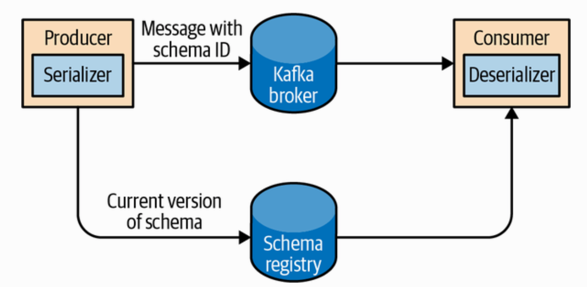

###1. Custom Serializers

```
Either using a generic serialization library like Avro, Thrift, 
or Protobuf to create records, or creating a custom serialization 
for objects you are already using. 
We highly recommend using a generic serialization library. 
```

####Example:

1-1) Customer.java
```java
public class Customer {
    private int customerID;
    private String customerName;

    public Customer(int ID, String name) {
        this.customerID = ID;
        this.customerName = name;
    }

    public int getID() {
        return customerID;
    }

    public String getName() {
        return customerName;
    }
}
```

1-2) create a custom serializer for this class
```java
import org.apache.kafka.common.errors.SerializationException;

import java.nio.ByteBuffer;
import java.util.Map;

public class CustomerSerializer implements Serializer<Customer> {

    @Override
    public void configure(Map configs, boolean isKey) {
        // nothing to configure
    }

    /**
         We are serializing Customer as:
         4 byte int representing customerId
         4 byte int representing length of customerName in UTF-8 bytes 
         (0 if name is Null)
         N bytes representing customerName in UTF-8
     **/
    @Override
    public byte[] serialize(String topic, Customer data) {
        try {
            byte[] serializedName;
            int stringSize;
            if (data == null)
                return null;
            else {
                if (data.getName() != null) {
                    serializedName = data.getName().getBytes("UTF-8");
                    stringSize = serializedName.length;
                } else {
                    serializedName = new byte[0];
                    stringSize = 0;
                }
            }

            ByteBuffer buffer = ByteBuffer.allocate(4 + 4 + stringSize);
            buffer.putInt(data.getID());
            buffer.putInt(stringSize);
            buffer.put(serializedName);

            return buffer.array();
        } catch (Exception e) {
            throw new SerializationException(
                "Error when serializing Customer to byte[] " + e);
        }
    }

    @Override
    public void close() {
        // nothing to close
    }
}
```

1-3) Code Problem
```
That code is fragile. 
Because if we ever have too many customers, for example, and need to change 
customerID to Long, or if we ever decide to add a startDate field to 
Customer, we will have a serious issue in maintaining compatibility 
between old and new messages. 
```

1-4) Improve Solution
```
For these reasons, we recommend using existing serializers and deserializers 
such as JSON, Apache Avro, Thrift, or Protobuf. 
```

&nbsp;

###2. Serializing Using Apache Avro

>Apache Avro is a language-neutral data serialization format.

```
Avro data is described in a language-independent schema. 
The schema is usually described in JSON, and the serialization is 
usually to binary files, although serializing to JSON is also supported. 

Avro assumes that the schema is present when reading and writing files, 
usually by embedding the schema in the files themselves.
```

* schema example
```json
{
    "namespace": "customerManagement.avro",
     "type": "record",
     "name": "Customer",
     "fields": [
         { "name": "id", "type": "int" },
         { "name": "name",  "type": "string" },
         { "name": "faxNumber", "type": ["null", "string"], 
           "default": "null"} 
     ]
}
```

* the benefit of using Avro: 
```  
Even though we changed the schema in the messages without changing 
all the applications reading the data, there will be no exceptions 
or breaking errors and no need for expensive updates of existing data.
```

&nbsp;

###3. Using Avro Records with Kafka

- Schema Registry



>Store all the schemas used to write data to Kafka in the registry.

```
1) We simply store the identifier for the schema in the record we produce to Kafka. 
2) The consumers can then use the identifier to pull the record out 
   of the Schema Registry and deserialize the data. 
3) The key is that all this work—storing the schema in the registry 
   and pulling it up when required—is done in the serializers and deserializers. 
4) The code that produces data to Kafka simply uses the Avro serializer.
```

- eg:produce generated Avro objects to Kafka
```java
Properties props = new Properties();

props.put("bootstrap.servers", "localhost:9092");
props.put("key.serializer",
   "io.confluent.kafka.serializers.KafkaAvroSerializer");
props.put("value.serializer",
   "io.confluent.kafka.serializers.KafkaAvroSerializer"); 
props.put("schema.registry.url", schemaUrl);

String topic = "customerContacts";

Producer<String, Customer> producer = new KafkaProducer<>(props); 

// We keep producing new events until someone ctrl-c
while (true) {
    Customer customer = CustomerGenerator.getNext(); 
    System.out.println("Generated customer " +
        customer.toString());
    ProducerRecord<String, Customer> record =
        new ProducerRecord<>(topic, customer.getName(), customer); 
    producer.send(record); 
}
```

- code explanation
```
1) We use the KafkaAvroSerializer to serialize our objects with Avro. 
   Note that the KafkaAvroSerializer can also handle primitives, 
   which is why we can later use String as the record key and our Customer object 
   as the value.
   
2) schema.registry.url is the configuration of the Avro serializer that will be 
   passed to the serializer by the producer. 
   It simply points to where we store the schemas.  
   Customer is our generated object. 
   We tell the producer that our records will contain Customer as the value. 
   
3) Customer class is not a regular Java class(POJO) but rather a specialized 
   Avro object, generated from a schema using Avro code generation. 
   The Avro serializer can only serialize Avro objects, not POJO. 
   Generating Avro classes can be done either using the avro-tools.jar or 
   the Avro Maven plug-in, both part of Apache Avro. 
   (
   See the Apache Avro Getting Started (Java) guide for details 
   on how to generate Avro classes:
   https://avro.apache.org/docs/current/gettingstartedjava.html
   )
   
That’s it. We send the record with our Customer object, 
and KafkaAvroSerializer will handle the rest.
```

<hr>

- use generic Avro objects
  
####To use generic Avro objects, you just need to provide the schema:
```java
Properties props = new Properties();
props.put("bootstrap.servers", "localhost:9092");
props.put("key.serializer",
   "io.confluent.kafka.serializers.KafkaAvroSerializer"); 
props.put("value.serializer",
   "io.confluent.kafka.serializers.KafkaAvroSerializer");
props.put("schema.registry.url", url); 

String schemaString =
    "{\"namespace\": \"customerManagement.avro\",
     "\"type\": \"record\", " + 
     "\"name\": \"Customer\"," +
     "\"fields\": [" +
      "{\"name\": \"id\", \"type\": \"int\"}," +
      "{\"name\": \"name\", \"type\": \"string\"}," +
      "{\"name\": \"email\", \"type\": " + "[\"null\",\"string\"], " +
       "\"default\":\"null\" }" +
    "]}";
Producer<String, GenericRecord> producer =
   new KafkaProducer<String, GenericRecord>(props); 

Schema.Parser parser = new Schema.Parser();
Schema schema = parser.parse(schemaString);

for (int nCustomers = 0; nCustomers < customers; nCustomers++) {
    String name = "exampleCustomer" + nCustomers;
    String email = "example " + nCustomers + "@example.com";
    
    GenericRecord customer = new GenericData.Record(schema);
    customer.put("id", nCustomers);
    customer.put("name", name);
    customer.put("email", email);
    
    ProducerRecord<String, GenericRecord> data =
    new ProducerRecord<>("customerContacts", name, customer);
    producer.send(data);
}
```

- code explanation

```
Our object type is an Avro GenericRecord, 
which we initialize with our schema and the data we want to write.

Then the value of the ProducerRecord is simply a GenericRecord 
that contains our schema and data. 
The serializer will know how to get the schema from this record, 
store it in the Schema Registry, and serialize the object data.
```

