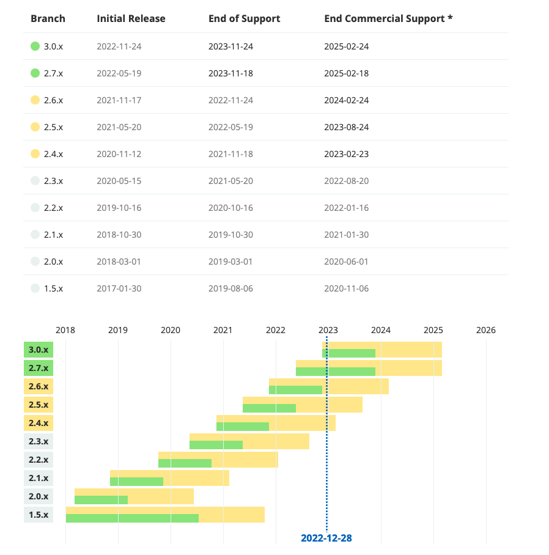

[Back](README.md)

### 1. What is Spring Boot

- Authoritative Definition

  > Spring Boot Extension is Spring's convention-over-configuration solution for creating stand-alone, production-grade Spring-based Applications that you can "just run".Most Spring Boot applications need very little Spring configuration.

[Official Site](https://spring.io/projects/spring-boot#support)

- Current Latest Version

| Version            | Doc           | API     |
| ------------------ | ------------- | ------- |
| 3.0.1 GA (CURRENT) | Reference Doc | API Doc |
| 2.7.7              | Reference Doc | API Doc |

- History Versions
  
