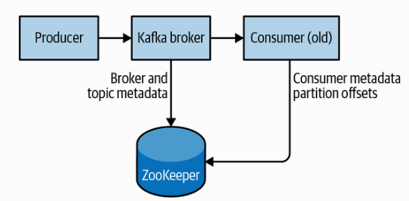

###1) Installing Java

```
The latest versions of Kafka support both Java 8 and Java 11. 
```

<hr>

###2) Installing ZooKeeper

>Apache Kafka uses Apache ZooKeeper to store metadata about the Kafka cluster, as well as consumer client details

*ZooKeeper is a centralized service for maintaining configuration information, naming, providing distributed synchronization, and providing group services.*



download link: https://zookeeper.apache.org/releases.html

```
cd /install_pkg
tar -zxf apache-zookeeper-3.7.0-bin.tar.gz

mv apache-zookeeper-3.7.0-bin /soft/zookeeper-3.7.0

cd /soft/zookeeper-3.7.0/conf
cp zoo_sample.cfg zoo.cfg

mkdir -p /var/lib/zookeeper
vi zoo.cfg
#(see detail in zoo.cfg)

# start zookeeper
cd /soft/zookeeper-3.7.0/bin
./zkServer.sh start &

# test via telnet
telnet localhost 2181
srvr

# restult as below
Zookeeper version: 3.7.0-e3704b390a6697bfdf4b0bef79e3da7a4f6bac4b, built on 2021-03-17 09:46 UTC
Latency min/avg/max: 0/0.0/0
Received: 1
Sent: 0
Connections: 1
Outstanding: 0
Zxid: 0x0
Mode: standalone
Node count: 5
Connection closed by foreign host
```

<hr>

###3) Installing a Kafka Broker

```
cd /install_pkg
tar -zxf kafka_2.13-3.1.0.tgz
mv kafka_2.13-3.1.0 /soft/kafka-3.1.0


mkdir /tmp/kafka-logs
cd /tmp/kafka-logs
rm -rf *
# start kafka
cd /soft/kafka-3.1.0/bin

#./kafka-server-start.sh /soft/kafka-3.1.0/config/server.properties &
./kafka-server-start.sh -daemon ../config/server.properties
```

<hr>

###4) Create a topic

```
cd /soft/kafka-3.1.0/bin

# create topic
./kafka-topics.sh --bootstrap-server localhost:9092 --create --replication-factor 1 --partitions 1 --topic test
# result
Created topic test

# verify topic
./kafka-topics.sh --bootstrap-server localhost:9092 --describe --topic test
# result
---------------------------------------------------------------------------------------------
Topic: test     TopicId: OFw_zVI1TjWULLEu3SyTNA PartitionCount: 1       ReplicationFactor: 1    Configs: segment.bytes=1073741824
        Topic: test     Partition: 0    Leader: 0       Replicas: 0     Isr: 0
---------------------------------------------------------------------------------------------        

# Produce messages to a test topic (use Ctrl-C to stop the producer at any time)
./kafka-console-producer.sh --bootstrap-server localhost:9092 --topic test

# input below
>test from producer 1
>test from producer 2

# Consume messages from a test topic(open another terminal session)
cd /soft/kafka-3.1.0/bin
./kafka-console-consumer.sh --bootstrap-server localhost:9092 --topic test --from-beginning

# result
# input below
>test from producer 1
>test from producer 2
```

&nbsp;

### 5) List all topics

```
cd /soft/kafka-3.1.0/bin
./kafka-topics.sh --list --bootstrap-server localhost:9092
```

&nbsp;

### 6) Shutdown Kafka

```
cd /soft/kafka-3.1.0/bin
./kafka-server-stop.sh
```

&nsp;

### 7) Shutdown Zookeeper

```
cd /soft/zookeeper-3.6.3/bin

./zkServer.sh stop
```


