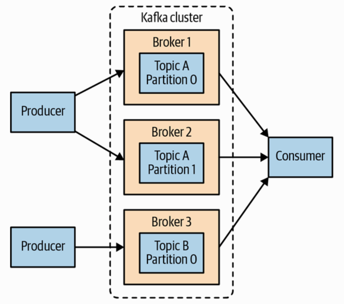

###1. General Broker Parameters

- broker.id

```
Every Kafka broker must have an integer identifier, 
which is set using the broker.id configuration.
(By default, this integer is set to 0, but it can be any value.)

The broker.id must be unique for each broker within a single Kafka cluster. 
best practise:
(
    host1.example.com  broker.id: 1
    host2.example.com  broker.id: 2 
)
```

<hr>

- zookeeper.connect

```
The location of the ZooKeeper used for storing the broker metadata.
(eg: ocalhost:2181)

semicolon separated
(eg: host1:port/path;host2:port/path;...;hostN:port/path)
```

<hr>

- log.dirs

```
Kafka persists all messages to disk, and these log segments are 
stored in the directory specified in the log.dir configuration. 
```

<hr>

- auto.leader.rebalance.enable

```
In order to ensure a Kafka cluster doesn’t become unbalanced by having all topic 
leadership on one broker, this config can be specified to ensure leadership is 
balanced as much as possible.

It enables a background thread that checks the distribution of partitions at regular intervals 
(this interval is configurable via leader.imbalance.check.interval.seconds)
```

&nbsp;

###2. HOW TO CHOOSE THE NUMBER OF PARTITIONS

>You want many partitions, but not too many

- What is the throughput you expect to achieve for the topic?

```
For example, do you expect to write 100 KBps or 1 GBps?
```

- What is the maximum throughput you expect to achieve when consuming from a single partition? 

```
A partition will always be consumed completely by a single consumer 
(even when not using consumer groups, the consumer must read all messages in the partition).

eg:
If you know that your slower consumer writes the data to a database and 
this database never handles more than 50 MBps from each thread writing to it, 
then you know you are limited to 50 MBps throughput when consuming from a partition.
```

- diskspace/network bandwidth
```
Consider the number of partitions you will place on each broker and 
available diskspace and network bandwidth per broker.
```


<hr>

- in action scenario(important)

```
eg:
We want to be able to write and read 1 GBps from a topic, 
and we know each consumer can only process 50 MBps, 
then we know we need at least 20 partitions. 
This way, we can have 20 consumers reading from the topic and achieve 1 GBps.

If you don’t have this detailed information, our experience suggests that limiting 
the size of the partition on the disk to less than 6 GB per day of 
retention often gives satisfactory results. 

Starting small and expanding as needed is easier than starting too large.
```

&nbsp;

###3. Simple Kafka Cluster




