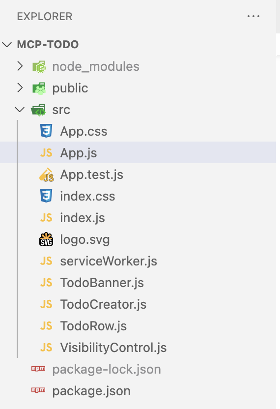

[Back](README.md)

## First React Example ToDo

<hr>

### 1. Creating the Project

```
npx create-react-app todo
```

&nbsp;

### 2. Project Structure



#### Detail of the important files of the skeleton

| Name              | Description                                                                                                                                                                                                   |
| ----------------- | ------------------------------------------------------------------------------------------------------------------------------------------------------------------------------------------------------------- |
| public/index.html | This is the HTML file that is loaded by the browser. It contains an element in which the application is displayed and a script element that loads the application’s JavaScript files.                         |
| src/index.js      | This is the JavaScript file that is responsible for configuring and starting the React application. You can also use this file to add the CSS framework to the application.                                   |
| src/App.js        | This is the React component, which contains the HTML content that will be displayed to the user and the JavaScript code required by the HTML. Components are the main building blocks in a React application. |

&nbsp;

### 3. Adding the Bootstrap CSS Framework

##### 3-1) Adding the Bootstrap CSS Framework

```
cd todo
npm install bootstrap@4.1.2
```

##### 3-2) Include Bootstrap in the index.js File in the src Folder

- key code:
  **import 'bootstrap/dist/css/bootstrap.css';**

```
import React from 'react';
import ReactDOM from 'react-dom';
import './index.css';
import App from './App';
import * as serviceWorker from './serviceWorker'; import 'bootstrap/dist/css/bootstrap.css';
ReactDOM.render(<App />, document.getElementById('root'));
// If you want your app to work offline and load faster, you can change
// unregister() to register() below. Note this comes with some pitfalls.
// Learn more about service workers: http://bit.ly/CRA-PWA
serviceWorker.unregister();
```

#### 3-3) Start the project

```
npm start
```

access url: http://localhost:3000/


&nbsp;

### 4. Replacing the Placeholder Content

##### 4-1) Removing the Placeholder in the App.js File in the src Folder

The App.js file contains a React component, which is named App. Components are the main building block for React applications, and they are written using JSX, which is a superset of JavaScript that allows HTML to be included in code files without requiring any special quoting.

```
import React, { Component } from 'react';
//import logo from './logo.svg';
//import './App.css';
export default class App extends Component {
    render() {
        return (
            <div>
                <h4 className="bg-primary text-white text-center p-2">
                    To Do List
                </h4>
            </div>
        )
    };
}
```

rebuild the application, see below effect:


differences between regular HTML files and JSX files

In regular HTML, the class attribute is used to assign elements to classes, which is how elements are styled when using the Bootstrap CSS framework. Even though it might not appear so, JSX files are JavaScript files, and JavaScript configures classes through the className property.

see below code:

```
<h4 className="bg-primary text-white text-center p-2">
    To Do List
</h4>
```

&nbsp;

### 5. Displaying Dynamic Content

##### 5-1) Adding State Data and Data Bindings in the App.js

```
import React, { Component } from 'react';

export default class App extends Component {
    constructor(props) {
        super(props);
        this.state = {
            userName: "Adam"
        }
    }

    render() {
            return (
                <div>
                    <h4 className="bg-primary text-white text-center p-2">
                        { this.state.userName }'s To Do List
                    </h4>
                </div>
            )
    };
}
```

Once state data has been defined, it can be included in the content generated by the component in an expression, like this:

```
<h4 className="bg-primary text-white text-center p-2">
    { this.state.userName }'s To Do List
</h4>
```

Effect Below:


##### 5-2) Understanding State Data Changes

The dynamic nature of a React application is based on changes to state data, which React responds to by invoking the component’s render method again, which causes the expressions to be re-evaluated using the new state data values.

##### Changing State Data in the App.js

```
import React, { Component } from 'react';
export default class App extends Component {
    constructor(props) {
        super(props);
        this.state = {
            userName: "Adam"
    } }

    changeStateData = () => {
        this.setState({
            userName: this.state.userName === "Adam" ? "Bob" : "Adam"
        })
    }

    render() {
        return (
            <div>
                <h4 className="bg-primary text-white text-center p-2">
                    { this.state.userName }'s To Do List
                </h4>
                <button className="btn btn-primary m-2"
                        onClick={ this.changeStateData }>
                    Change
                </button>
            </div>
        )
    };
}
```

Effect Below:

