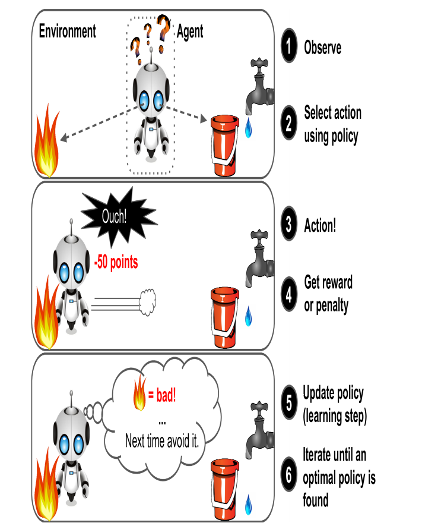

[Back](README.md)

## Foundations

<hr>

### 1. Categories
>ML systems can be classified according to the amount and type of
supervision they get during training.
They are: supervised learning, unsupervised learning, self supervised learning, semi-supervised learning, and Reinforcement
Learning.
- Supervised learning
    >In supervised learning, the training set you feed to the algorithm includes
    the desired solutions, called labels.
    ```
    A typical supervised learning task is classification.
    eg:
     1) spam filter - it trained with many example emails along with their class 
        (spam or ham), and it must learn how to classify new emails.
     2) predict a target numeric value, such as the price of a car, given a set of 
        features (mileage, age, brand, etc.). This sort of task is called regression.
    ```
- Unsupervised learning
    >In unsupervised learning, the training data is unlabeled, the system tries to learn without a teacher.
    ```
    eg:
    say you have a lot of data about your blog’s visitors. 
    You may want to run a clustering algorithm to try to detect groups of similar visitors. 
    For example, it might notice that 40% of your visitors are teenagers who love comic books 
    and generally read your blog after school, while 20% are adults who enjoy
    sci-fi and who visit during the weekends.
    ```
- Semi-supervised learning
    >Since labeling data is usually time-consuming and costly, you will often have plenty of unlabeled instances, and few labeled instances. 
    Some algorithms can deal with data that’s partially labeled. This is called semi supervised learning.
    ```
    eg:
    Some photo-hosting services, such as Google Photos, once you upload all your family photos to the service, 
    it automatically recognizes that the same person A shows up in photos 1, 5, and 11, 
    while another person B shows up in photos 2, 5, and 7. 
    This is the unsupervised part of the algorithm (clustering). 
    Now all the system needs is for you to tell it who these people are. 
    Just add one label per person and it is able to name everyone in every photo, which is useful for searching photos.
    Most semi-supervised learning algorithms are combinations of unsupervised and supervised algorithms.
    ```
- Self-supervised learning
    >This is generating a fully labeled dataset from a fully unlabeled one. 
    Once the whole dataset it labeled, any supervised learning algorithm can be used.
    This approach iscalled self-supervised learning.
    ```
    eg:
    if you have a large dataset of unlabeled images, 
    you can randomly mask a small part of each image and then train a model 
    to recover the original image. 
    During training, the masked images are used as the inputs to the model, 
    and the original images are used as the labels.
    ```
- Reinforcement Learning
    >Reinforcement Learning is a very different beast. 
    The learning system, called an agent in this context, can observe the environment, 
    select and perform actions, 
    and get rewards in return(or penalties in the form of negative rewards).
    It must then learn by itself whatis the best strategy, called a policy, 
    to get the most reward over time. 
    A policy defines what action the agent should choose when it is in a given situation.
    (DeepMind’s AlphaGo program is also a good example of Reinforcement Learning)
    

