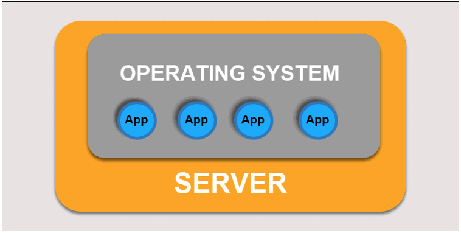
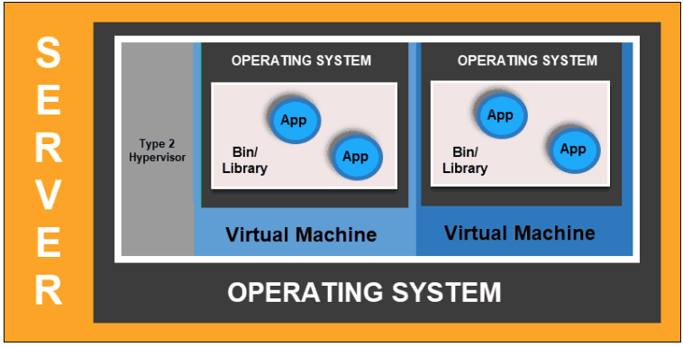
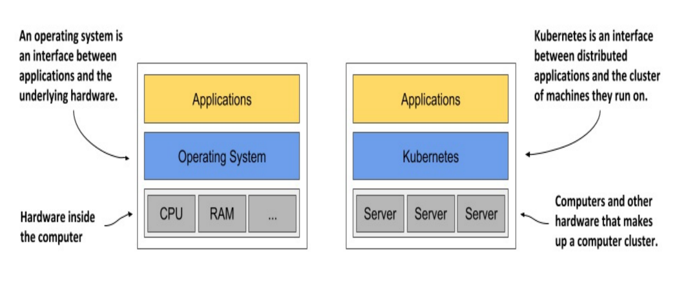
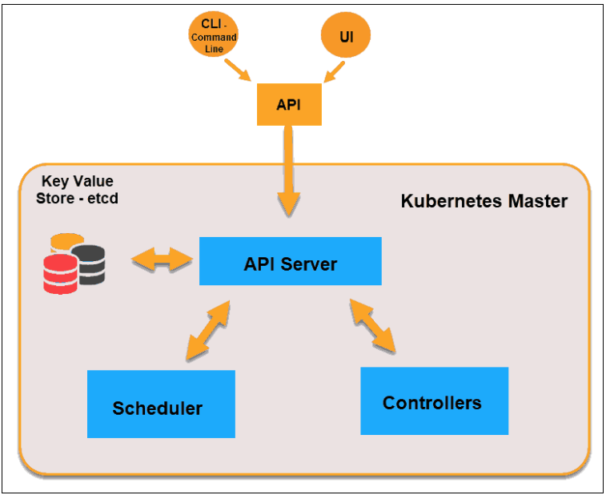
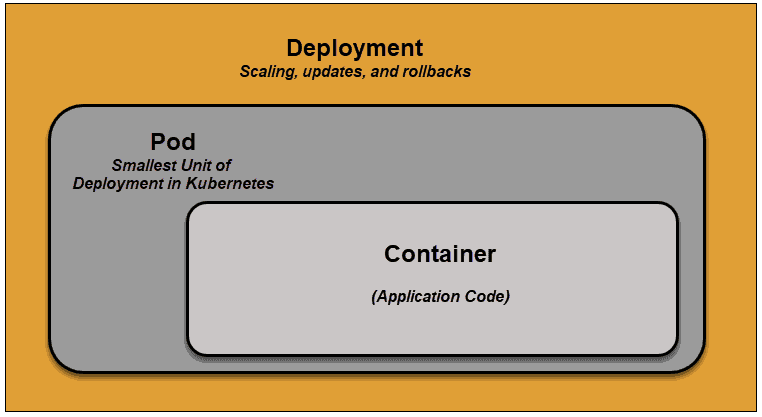
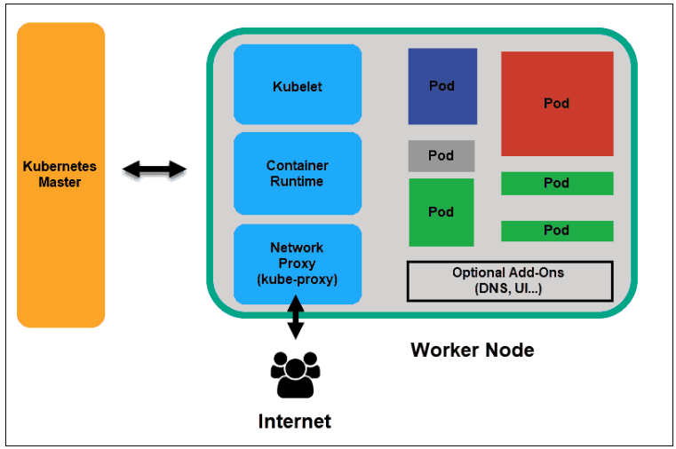
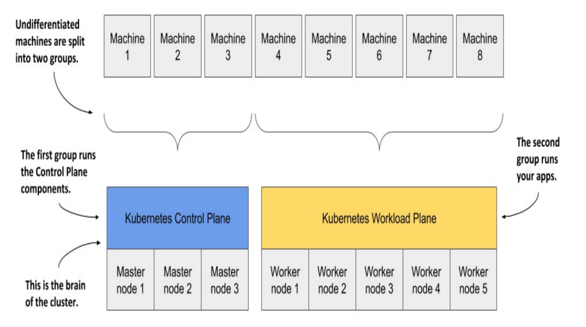

[Back](README.md)

## Introduction

<hr>

### 0. Difference among Traditional/Virtualized/Container Deployments

- Traditional Deployment



- Virtualized Deployment



- Container Deployment


&nbsp;

### 1. What is Kubernetes

- Authoritative Definition

  > Kubernetes, also known as K8s, is an open-source system for automating deployment, scaling, and management of containerized applications.
  >
  > It groups containers that make up an application into logical units for easy management and discovery.

  >Kubernetes is like an operating system for computer clusters.



- History
  > Kubernetes builds upon 15 years of experience of running production workloads at Google, combined with best-of-breed ideas and practices from the community.
  >
  > Kubernetes is a big open source project and ecosystem with a lot of code and
  > a lot of functionality. Kubernetes came out of Google, but joined the Cloud Native Computing Foundation (CNCF) and became the clear leader in the space of container-based applications.

- Why Kubernetes
  >Modern applications are dispersed across clouds, virtual machines, and servers. Administering apps manually is no longer a viable option.
  >K8s transforms virtual and physical machines into a unified API surface. A developer can then use the Kubernetes API to deploy, scale, and manage containerized applications.

  It helps manage containers that run the applications and ensures there is no downtime in a production environment. For example, if a container goes down, another container automatically takes its place without the end-user ever noticing.

&nbsp;

### 2. Capabilities of kubernetes

- Scheduling workloads in containers across your infrastructure
- Mounting storage systems
- Distributing secrets
- Checking application health and readiness
- Replicating application instances
- Using the Horizontal Pod Autoscaler
- Using Cluster Autoscaling
- Naming and service discovery
- Balancing loads
- Rolling updates
- Monitoring resources
- Accessing and ingesting logs
- Debugging applications
- Providing authentication and authorization

&nbsp;

### 3. What is container orchestration

The primary responsibility of Kubernetes is container orchestration.

Container orchestration makes sure that all the containers that execute various workloads are scheduled to run on physical or virtual machines.

The containers must be packed efficiently following the constraints of the deployment environment and the cluster configuration.

In addition, Kubernetes must keep an eye on all running containers and replace dead, unresponsive, unhealthy containers.

&nbsp;

### 4. Benefits of containers

- Agile application creation and deployment
- Continuous development, integration, and deployment
- Dev and Ops separation of concerns
- Environmental consistency across development, testing, staging, and production
- Cloud and OS distribution portability
- Application-centric management (dependencies are packaged with the application)
- Resource isolation (container CPU and memory can be limited)
- Resource utilization (multiple containers can be deployed on the same node)

&nbsp;

### 5. Containers in the cloud

- The rise of containerization in microservices

  Containers are ideal to package microservices because while providing isolation to the microservice, they are very lightweight compared with virtual machines.
  This makes containers ideal for cloud deployment, where allocating a whole virtual machine for each microservice would be cost-prohibitive.

&nbsp;

- Kubernetes in the Cloud

  All major cloud providers, such as Amazon Web Services (AWS), Google Cloud Platform (GCP), and Microsoft's Azure, provide container hosting services.
  At the end of 2017, all cloud providers announced direct support for Kubernetes. Microsoft's launched AKS, AWS released EKS, and Alibaba Cloud started working on a Kubernetes controller manager to integrate Kubernetes seamlessly.

  - The Google Kubernetes Engine (GKE) was always based on Kubernetes.

  - Amazon's Elastic Kubernetes Service (EKS) was added in addition to the proprietary AWS ECS orchestration solution.

  - Microsoft Azure's container service used to be based on Apache Mesos but later switched to Kubernetes with Azure Kubernetes Service (AKS).

&nbsp;

### 6. Core concepts in kubernetes

#### 6-1) Clusters

> A cluster is a collection of hosts (nodes) that provide compute, memory, storage, and networking resources.

Kubernetes uses these resources to run the various workloads that comprise your system.
_(Note that your entire system may consist of multiple clusters.)_

#### 6-2) Nodes

> A node is a single host. It may be a physical or virtual machine. Its job is to run pods.

Each Kubernetes node runs several Kubernetes components, such as the kubelet, the container runtime, and kube-proxy.
Nodes are managed by a Kubernetes master.
The nodes are the worker bees of Kubernetes and they shoulder all the heavy lifting.

#### 6-3) Master

> The master is the control plane of Kubernetes, it is responsible for the global state of the cluster, cluster-level scheduling of pods, and handling of events.
>
> It consists of several components, such as an API server, a scheduler, and a controller manager.

Usually, all the master components are set up on a single host.
When considering high-availability scenarios or very large clusters, you will want to have master redundancy.



&nbsp;

#### 6-4) Pods

> A pod is the unit of work in Kubernetes.
>
> Each pod contains one or more containers.
>
> Containers in pods are always scheduled together (always run on the same machine).

All the containers in a pod have the same IP address and port space; they can communicate using localhost or standard inter-process communication.
In addition, all the containers in a pod can have access to shared local storage on the node hosting the pod.
Containers don't get access to local storage or any other storage by default. Volumes of storage must be mounted into each container inside the pod explicitly. Pods are an important feature of Kubernetes. It is possible to run multiple applications inside a single Docker container by having something like supervisord as the main Docker process that runs multiple processes.

Pods provide a great solution for managing groups of closely related containers that depend on each other and need to co-operate on the same host to accomplish their purpose.
Any pod storage is destroyed with its pod.
Each pod gets a unique ID (UID).



&nbsp;

#### 6-5) Labels

> Labels are key-value pairs that are used to group together sets of objects such as pods.

&nbsp;

#### 6-6) Annotations

> Annotations let you associate arbitrary metadata with Kubernetes objects.

#### 6-7) Label selectors

> Label selectors are used to select objects based on their labels.
> eg:

```
role = webserver

role = webserver, application != foo

role in (webserver, backend)
```

&nbsp;

#### 6-8) Services

> Services are used to expose some functionality to users or other services. They usually encompass a group of pods, usually identified by a label.

_Note that services operate at layer 3 (TCP/UDP)._

Services can be load-balanced by Kubernetes.

&nbsp;

#### 6-9) Names

> Each object in Kubernetes is identified by a UID and a name. The name is used to refer to the object in API calls.

&nbsp;

#### 6-10) Namespaces

> A namespace is a kind of virtual cluster. You can have a single physical cluster that contains multiple virtual clusters segregated by namespaces.

By default, pods in one namespace can access pods and services in other namespaces. In multi-tenancy scenarios where it's important to totally isolate namespaces, you can do it with proper network policies.

_Note that node objects and persistent volumes don't live in a namespace. Kubernetes may schedule pods from different namespaces to run on the same node. Likewise, pods from different namespaces can use the same persistent storage._

&nbsp;

### 7. Kubernetes Architecture and Components


- kubectl
  It is Kubernetes’ default command-line tool.

- etcd
  It is a Key-Value Stored database where Kubernetes stores the file(an application’s desired state).

- API Server
  The API Server is the front-end of the control plane and the only component in the control plane that we interact with directly. Internal system components, as well as external user components, all communicate via the same API.

- Key-Value Store (etcd)
  The Key-Value Store, also called etcd, is a database Kubernetes uses to back-up all cluster data. It stores the entire configuration and state of the cluster. The Master node queries etcd to retrieve parameters for the state of the nodes, pods, and containers.

- Controller
  The role of the Controller is to obtain the desired state from the API Server. It checks the current state of the nodes it is tasked to control, and determines if there are any differences, and resolves them, if any.

- Scheduler
  A Scheduler watches for new requests coming from the API Server and assigns them to healthy nodes. It ranks the quality of the nodes and deploys pods to the best-suited node. If there are no suitable nodes, the pods are put in a pending state until such a node appears.

#### Architecture diagram of kubernetes


&nbsp;

### 8. What is Worker Node in Kubernetes Architecture

>Worker nodes listen to the API Server for new work assignments; they execute the work assignments and then report the results back to the Kubernetes Master node.



- Kubelet
  The kubelet runs on every node in the cluster. It is the principal Kubernetes agent. By installing kubelet, the node’s CPU, RAM, and storage become part of the broader cluster. It watches for tasks sent from the API Server, executes the task, and reports back to the Master. It also monitors pods and reports back to the control panel if a pod is not fully functional. Based on that information, the Master can then decide how to allocate tasks and resources to reach the desired state.

- Container Runtime
  The container runtime pulls images from a container image registry and starts and stops containers. A 3rd party software or plugin, such as Docker, usually performs this function.

- Kube-proxy
  The kube-proxy makes sure that each node gets its IP address, implements local iptables and rules to handle routing and traffic load-balancing.

&nbsp;

### 9. How Kubernetes fits into a computer cluster




You start with a fleet of machines that you divide into two groups - the master and the worker nodes. 

The master nodes will run the Kubernetes Control Plane, which represents the brain of your system and controls the cluster,

The rest will run your applications - your workloads - and will therefore represent the Workload Plane.

_(Don’t be confused by the term “plane” either - in this context you can think of it as the “surface” the applications run on.)_

_Non-production clusters can use a single master node, but highly available clusters use at least three physical master nodes to host the Control Plane. The number of worker nodes depends on the number of applications you’ll deploy._

